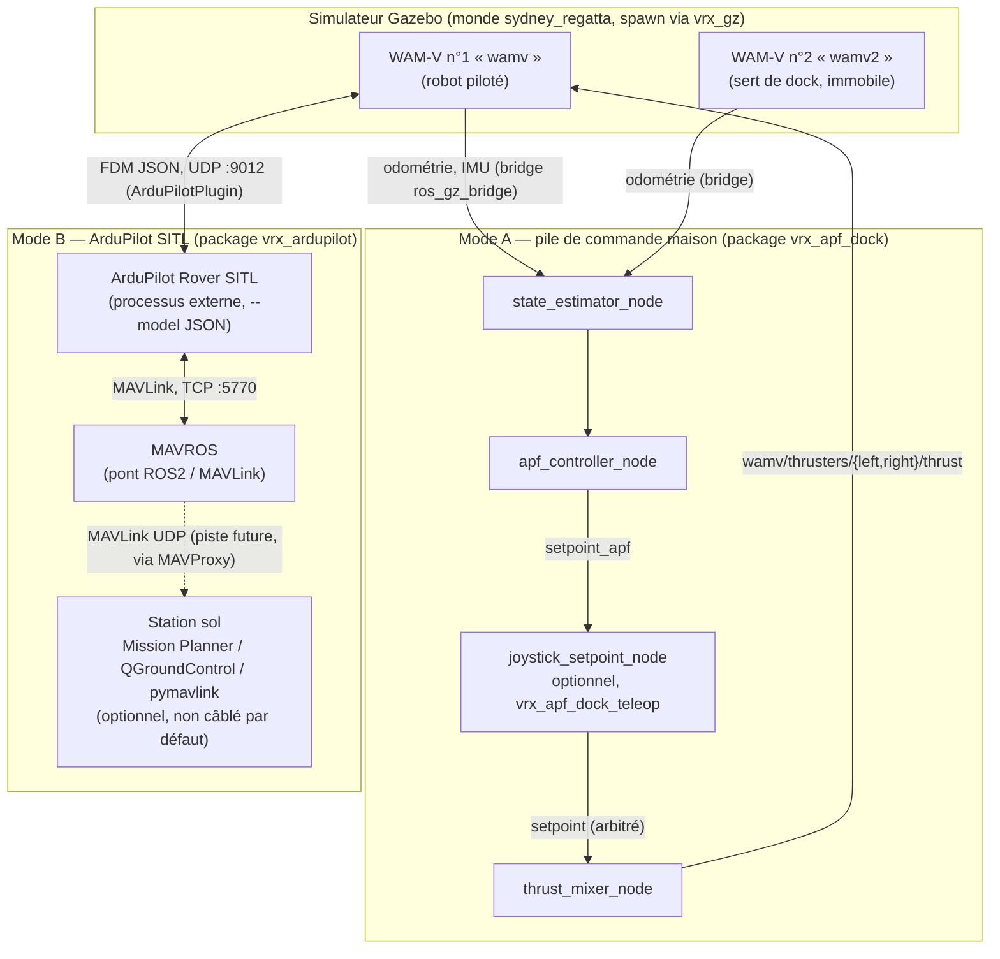
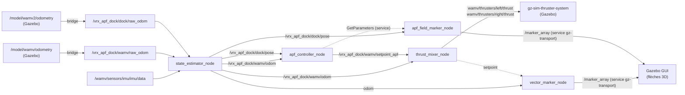
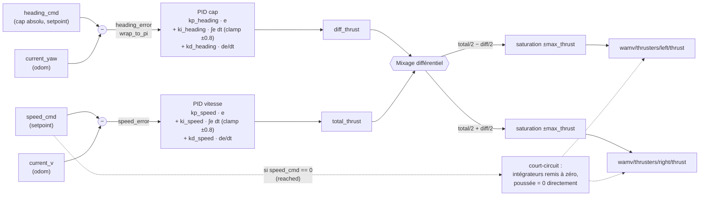
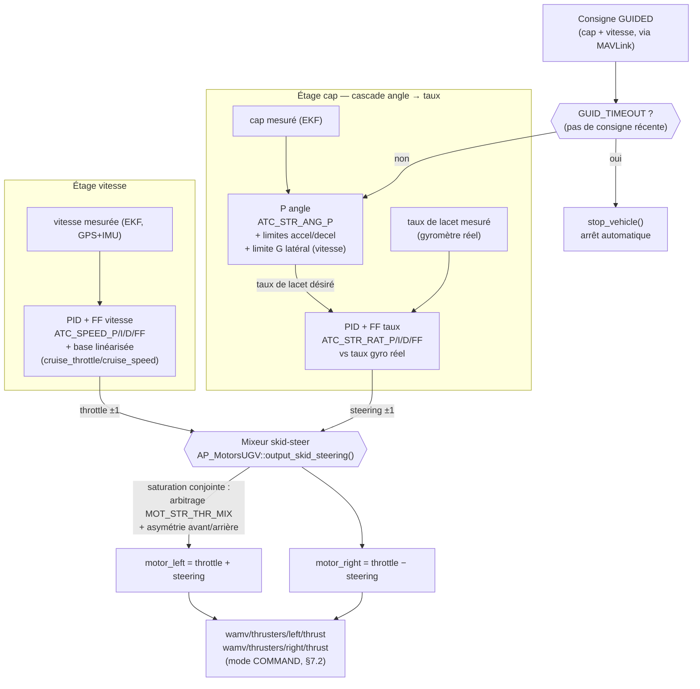
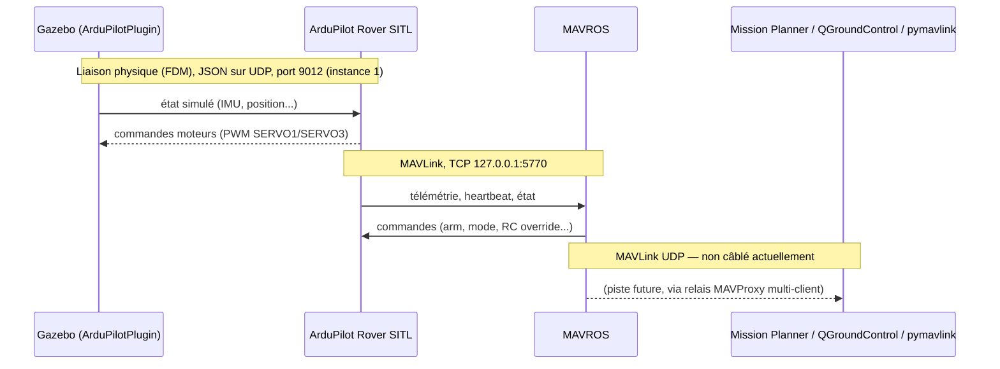

# Architecture du workspace `vrx_ws`

**Docking autonome d'un WAM-V par champs de potentiel (APF), avec bascule vers pilotage ArduPilot SITL / MAVROS**

Auteur : Yvan Eustache · Document généré le 2026-09-03

---

## 1. Contexte et objectif

Le point de départ (`260707_prompt.md`) était un énoncé simple : piloter un drone de surface (WAM-V) dans le simulateur **VRX** (Virtual RobotX, Gazebo/ROS 2) pour l'amener à une position et un cap précis, afin de le faire entrer dans un dock, en utilisant des **champs de potentiel artificiels (APF)**. Deux cas devaient être gérés :

1. le robot est **devant** le dock → il est attiré par la position et le cap du dock ;
2. le robot est **derrière** le dock → il est repoussé vers l'intérieur du dock, attiré par le cap inverse.

Le point de départ fourni était une paire de fichiers de référence académiques (ENSTA Bretagne, Luc Jaulin) : `controller.py` (loi de commande APF) et `roblib.py` (bibliothèque robotique/maths générique).

Le projet a ensuite été étendu dans une seconde phase (`260819_ardupilot_development.md`) pour remplacer la boucle de commande maison par un pilote de vol réel : **ArduPilot Rover**, exécuté en simulation logicielle (**SITL**), piloté via **MAVLink**/**MAVROS**, ouvrant la voie à une supervision par une station sol type **Mission Planner**.

Le workspace contient donc aujourd'hui **deux façons distinctes de faire avancer le même WAM-V** dans le même monde Gazebo : la pile de commande maison (APF), et ArduPilot SITL. Ce document décrit l'architecture des deux.

---

## 2. Ce qui vient du projet initial vs. ce qui a été ajouté

`vrx_ws` assemble trois dépôts amont (clonés tels quels dans `src/` et `ardupilot/`, chacun avec son propre `.git`) et du code entièrement nouveau développé par-dessus.

| Composant | Origine | Statut dans ce workspace |
|---|---|---|
| `src/vrx` | [osrf/vrx](https://github.com/osrf/vrx) — simulateur de compétition VRX officiel | **Modifié** (patches locaux, non commités) + nouveaux fichiers |
| `src/ardupilot_gazebo` | [ArduPilot/ardupilot_gazebo](https://github.com/ArduPilot/ardupilot_gazebo) — plugin Gazebo reliant ArduPilot à la simulation | **Modifié** (1 fichier patché) |
| `ardupilot/` | [ArduPilot/ardupilot](https://github.com/ArduPilot/ardupilot) — firmware/SITL complet | Non modifié, utilisé tel quel comme **processus externe** |
| `src/vrx_apf_dock` | — | **Nouveau** : package ROS 2 complet, la pile de commande APF (5 nœuds) |
| `src/vrx_apf_dock_teleop` | — | **Nouveau** : package ROS 2, arbitrage joystick / bascule mode manuel ↔ docking auto |
| `src/vrx_ardupilot` | — | **Nouveau** : package ROS 2 « colle » (spawn + config), aucun nœud Python, pilote de vol externe |
| `controller.py`, `classBoat.py`, `roblib.py` (racine) | ENSTA Bretagne (Luc Jaulin), fournis en énoncé | Conservés tels quels comme **référence académique** — non exécutés en run-time, mais `apf_lib.py` en est un portage affiné |
| `vrx_docker/` | — | **Nouveau** : Dockerfile + scripts de déploiement minimal ROS 2 |
| `*.md` à la racine | — | **Nouveau** : journal de développement tenu au fil de l'eau (traçabilité des décisions) |
| `MisionPlanner/` | Binaires officiels Mission Planner | Outil GCS installé sur la machine, utilisé de façon indépendante ; **non scripté/intégré** dans ce workspace |

---

## 3. Vue d'ensemble — les deux modes d'exploitation



Les deux modes sont **mutuellement exclusifs sur un même WAM-V** : soit le moteur thruster gz-sim est piloté par `thrust_mixer_node` (Mode A), soit il est piloté par le plugin `ArduPilotPlugin` en mode `COMMAND` sur les mêmes topics `wamv/thrusters/{left,right}/thrust` (Mode B). Le choix se fait au niveau du fichier de lancement (`apf_dock.launch.py` / `apf_dock_teleop.launch.py` vs `ardupilot_wamv.launch.py`) et du fichier de config de spawn (`two_wamv.yaml` vs `ardupilot_wamv.yaml`, champ `ardupilot: true`).

---

## 4. Le package `vrx_apf_dock` — pile de commande APF

C'est le cœur du projet : 5 nœuds ROS 2 (package `ament_python`), plus une bibliothèque de calcul pure sans dépendance ROS.



### 4.1 `state_estimator_node`

Reconstruit l'état complet du WAM-V à partir de capteurs bruts, car **le WAM-V n'a pas de capteur de vitesse direct**.

- **Entrées** : odométrie brute Gazebo du bateau (`raw_odom`) et du dock (`raw_odom`), IMU (`sensor_msgs/Imu`).
- **Sorties** : `wamv/odom` (position + vitesse estimée), `dock/pose` (pose du dock, simple retransmission).
- **Algorithme** : intégration à fuite (« leaky integration ») de l'accélération longitudinale mesurée par l'IMU : `dv/dt = a − leak·v` avec `leak = 0.2 s⁻¹`. Ce filtre évite la dérive d'une intégration pure tout en donnant une estimée de vitesse exploitable pour l'asservissement.

### 4.2 `apf_lib.py` — la loi de commande (`ApfDockController`)

Ce n'est **pas un nœud ROS**, mais une classe Python pure (NumPy uniquement), portée et affinée depuis `controller.py`/`classBoat.py`. Elle est réutilisée par `apf_controller_node.py` (run-time) et par l'outil de réglage `scripts/plot_apf_field.py` (hors run-time).

Elle calcule, à chaque appel `compute(p_robot, p_dock, theta_dock)`, un couple **(vitesse consigne, cap consigne)** selon deux branches, correspondant aux deux cas de l'énoncé initial :

- **Branche « conique »** (`back_branch`, robot du côté opposé au cap du dock) : potentiel attractif conique `c21·diff/r³` vers le point du dock + potentiel uniforme `c22·unit` poussant le long du cap du dock, **plus** un terme de répulsion à distance finie (`safety_radius`, `safety_gain`, ajouté par rapport à la référence académique) pour empêcher le bateau de raser la coque du dock.
- **Branche « plan/ligne »** (sinon) : potentiel `−c11·n·(n·diff)` qui ramène le robot sur l'axe du cap du dock + potentiel uniforme `c12·(−unit)` qui l'attire vers un point d'approche `p_dock + margin·unit(theta_dock)`.

Un mécanisme d'**hystérésis** (`_switch_value`, `_active`) évite les oscillations à la frontière entre les deux branches, et un verrou final `_reached` (rayon `reached_radius`, uniquement validé depuis la branche « plan/ligne » pour éviter un faux positif en approchant par le mauvais côté) fige la commande à `(0, 0)` une fois arrivé.

Tous les gains (`c11, c12, c21, c22, vmax, margin, transition_dist, reached_radius, safety_radius, safety_gain`) sont exposés comme **paramètres ROS 2 réglables à chaud** sur `apf_controller_node` (`ros2 param set` / `rqt_reconfigure`).

### 4.3 `apf_controller_node`

- **Entrées** : `wamv/odom`, `dock/pose`, `apf/reset` (`std_msgs/Empty`, remet à zéro les verrous internes de `ApfDockController`).
- **Sortie** : `wamv/setpoint_apf` (`geometry_msgs/Twist` détourné : `linear.x` = vitesse, `angular.z` = **cap absolu**, pas une vitesse angulaire).
- Appelle `ApfDockController.compute()` sur un timer à 20 Hz (`0.05 s`). Publie délibérément sur `setpoint_apf` et non directement sur `setpoint` : cela laisse la possibilité à `joystick_setpoint_node` de s'interposer en arbitre (voir §5). Sans le package teleop, `apf_dock.launch.py` remappe directement `setpoint_apf → setpoint`.

### 4.4 `thrust_mixer_node`

Le seul nœud qui parle réellement aux moteurs.

- **Entrées** : `wamv/odom` (déclenche la boucle), `wamv/setpoint` (vitesse + cap absolu consigne).
- **Sorties** : `wamv/thrusters/left/thrust`, `wamv/thrusters/right/thrust` (`std_msgs/Float64`, N).
- **Algorithme** : deux PID indépendants (cap et vitesse), mixés en poussée différentielle (`left = total/2 − diff/2`, `right = total/2 + diff/2`), saturés à `±max_thrust`. Cas particulier : si `speed_cmd == 0` (arrivée au dock), les PID sont court-circuités et la poussée mise à zéro directement, pour éviter que l'estimée de vitesse bruitée à bas régime ne génère une poussée parasite.

Le WAM-V (layout `H`, deux hélices fixes non azimutées) n'offre que deux leviers de commande pour deux degrés de liberté : les deux boucles sont calculées **indépendamment** puis recombinées uniquement au moment du mixage final.



Les deux boucles ne se voient jamais : le PID de cap ignore la vitesse, le PID de vitesse ignore le cap. Seul le bloc de mixage les recombine — `total_thrust` pousse les deux moteurs dans le même sens (avance/recul), `diff_thrust` les pousse en sens opposés (rotation, moteur droit plus fort → couple +z → le bateau tourne à gauche).

### 4.5 Visualisation dans Gazebo — `vector_marker_node`, `apf_field_marker_node`, `gz_marker_utils.py`

Ces nœuds ne publient **rien en ROS** : ils dessinent directement dans l'interface Gazebo via le **service gz-transport `/marker_array`** (`gz.msgs.Marker_V` → `gz.msgs.Boolean`), une fonctionnalité Gazebo sans équivalent ROS. Utile uniquement en mode graphique (no-op silencieux en `headless:=true`).

- `vector_marker_node` : deux flèches 3D en temps réel sur le bateau — rouge (cap/vitesse réels, depuis `wamv/odom`), verte (cap/vitesse consignes, depuis `wamv/setpoint`).
- `apf_field_marker_node` : échantillonne `ApfDockController.compute()` sur une grille autour du dock (une **instance fraîche du contrôleur par point de grille**, pour ne pas laisser fuiter l'état d'hystérésis d'un point à l'autre) et dessine le champ vectoriel complet en direct. Récupère les gains courants via un client de service `apf_controller_node/get_parameters`, pour que le champ affiché corresse toujours aux réglages en cours.

### 4.6 `geometry_utils.py`

Utilitaires purs (`yaw_from_quaternion`, `quaternion_from_yaw`, `wrap_to_pi`), réimplémentés localement pour éviter une dépendance à `tf_transformations`.

### 4.7 `scripts/plot_apf_field.py` (outil de développement, hors run-time)

Outil matplotlib autonome (aucune dépendance ROS/Gazebo) pour visualiser et régler interactivement le champ de potentiel (sliders sur `c11/c12/c21/c22`) avant de reporter les valeurs dans les paramètres ROS 2. Mode `--static --out fichier.png` pour un rendu hors écran.

---

## 5. Le package `vrx_apf_dock_teleop` — arbitrage joystick

Un seul nœud, `joystick_setpoint_node`, qui est **l'unique publieur** du topic final `wamv/setpoint` consommé par `thrust_mixer_node` : il arbitre entre pilotage manuel au joystick et délégation à `apf_controller_node`.

- **Entrées** : `/joy` (manette), `wamv/odom` (cap courant), `wamv/setpoint_apf` (consigne APF en continu).
- **Sorties** : `wamv/setpoint` (arbitré), `apf/reset` (envoyé à chaque activation du mode docking), `wamv2/thrusters/{left,right}/thrust` (pilotage direct et manuel du dock lui-même).
- **Commandes manette** (mapping de type Xbox) :
  - stick gauche vertical → vitesse, stick droit horizontal → **vitesse** de rotation intégrée en cap absolu ;
  - **L1 (deadman)** : maintenu = pilotage manuel actif, relâché = arrêt immédiat ;
  - **RB** : maintien à vitesse fixe `vconf` (échelon pour régler les PID) ;
  - **RT** (front montant) : pas de cap fixe `phiconf` (hors mode docking) ;
  - **LT** (front montant) : **bascule mode manuel ↔ docking automatique** — republie soit la consigne manuelle, soit la dernière consigne APF reçue ; déclenche `apf/reset` à l'activation ;
  - **A (maintenu)** : redirige les deux sticks vers le pilotage manuel en boucle ouverte du dock (`wamv2`), puisque celui-ci n'a pas d'estimateur de vitesse.

---

## 6. Origine académique — `controller.py`, `classBoat.py`, `roblib.py`

Ces trois fichiers, fournis avec l'énoncé initial (ENSTA Bretagne / Luc Jaulin, RobMOOC), ne sont **pas exécutés dans le système final** mais en sont la spécification de référence :

- `controller.py` : la loi APF originale, minimale, correspondant exactement aux équations de `TabAPF_robmooc.png`.
- `classBoat.py` : version plus complète (classe `Boat`), avec filtre de Kalman pour l'estimation d'état et un correcteur de cap PID intégré directement dans la loi de commande. C'est cette version qui a servi de base au réglage fin de `apf_lib.py` (distance de transition, amortissement proche cible, ré-armement de l'attraction après dérive). Une note `#TODO l'IMU du bateau n'est pas bien orienté` y explique pourquoi l'estimation de vitesse à bas régime reste peu fiable dans `vrx_apf_dock`.
- `roblib.py` : bibliothèque générique de calcul robotique/matriciel et de tracé (rotations, Lie algebra SO(3), tracé matplotlib de véhicules). Non importée par les packages ROS 2 (qui réimplémentent localement les quelques fonctions nécessaires pour éviter la dépendance matplotlib en run-time).

---

## 7. Le package `vrx_ardupilot` et l'intégration ArduPilot SITL

### 7.1 Rôle du package

`vrx_ardupilot` ne contient **aucun nœud Python** (`entry_points` vide) : c'est un package de « colle », qui fournit un fichier de lancement (`ardupilot_wamv.launch.py`) et une config de spawn (`ardupilot_wamv.yaml`, un seul WAM-V, champ `ardupilot: true`). Il fait apparaître le WAM-V dans Gazebo avec le plugin `ArduPilotPlugin` attaché, plus un pont d'odométrie de vérité-terrain pour le debug/visu. **ArduPilot SITL et MAVROS sont des processus externes**, démarrés indépendamment.

### 7.2 Modifications apportées au projet VRX pour supporter ce mode

Patches locaux (non commités, visibles via `git diff` dans `src/vrx`) :

- **`vrx_gz/src/vrx_gz/model.py`** : ajoute deux champs de config, `scale` (facteur d'échelle uniforme du WAM-V — coque, masse/inertie, hydrodynamique, propulseurs) et `ardupilot` (bascule `ardupilot_enabled:=true` côté xacro).
- **`wamv_gazebo.urdf.xacro`** : ajoute le bloc `<plugin name="ArduPilotPlugin">` (conditionné par `ardupilot_enabled`), et propage le `scale` aux batteries, à l'IMU, etc.
- **`wamv_gazebo_thruster_config.xacro`** : coefficients de traînée (`x_u`, `x_uu`) et diamètre d'hélice mis à l'échelle en `scale²`/`scale`.
- **Nouveau fichier `two_wamv.yaml`** : config de spawn à deux WAM-V (le robot `wamv`, échelle 0.5, et le dock `wamv2`, échelle 1) utilisée par le Mode A.

Le plugin `ArduPilotPlugin` est configuré en **mode `COMMAND`** plutôt qu'en actionnement direct des articulations des hélices : il publie une valeur `Double` directement sur les topics `wamv/thrusters/{left,right}/thrust`, **les mêmes topics natifs que `thrust_mixer_node`** — ArduPilot pilote ainsi la physique de propulsion déjà réglée de VRX, sans la dupliquer. Mapping PWM → poussée : `cmd = multiplier·(raw_cmd + offset)`, `offset = −0.5` (centre le neutre PWM 1500 sur 0 N), `multiplier = 1200` (±600 N, valeur non calibrée).

### 7.3 Asservissement interne d'ArduPilot — cap/vitesse → poussée différentielle

En Mode B, `thrust_mixer_node` ne tourne pas : c'est **ArduPilot lui-même** qui convertit une consigne de cap/vitesse (mode `GUIDED`, sous-mode `HeadingAndSpeed`) en poussée gauche/droite, avec une architecture plus riche que le PID unique de §4.4 — une cascade angle→taux pour le cap, un PID avec feedforward pour la vitesse, et un mixeur skid-steer à arbitrage de priorité.



**Différences structurelles avec `thrust_mixer_node`** (voir §4.4) :

| | `thrust_mixer_node` (maison) | ArduPilot |
|---|---|---|
| Cap | PID unique sur l'erreur de cap | Cascade P(angle) → PID+FF(taux gyro réel), limité en accel/decel et en G latéral selon la vitesse |
| Vitesse mesurée | Intégration IMU à fuite (bruitée, `state_estimator_node`) | EKF (fusion GPS+IMU) |
| Vitesse (commande) | PID seul | PID+FF + terme de base linéarisé (`cruise_throttle`/`cruise_speed`) |
| Mixage en saturation | Clamp indépendant par moteur (déforme le rapport cap/vitesse) | Réduction proportionnelle arbitrée (`MOT_STR_THR_MIX`) + asymétrie avant/arrière |
| Absence de consigne | — (rien de prévu) | `GUID_TIMEOUT` → arrêt automatique natif |

### 7.4 Modification du plugin `ardupilot_gazebo`

Un seul fichier patché, **`src/ArduPilotPlugin.cc`** : la détection du capteur IMU n'abandonne plus définitivement si elle échoue au premier tick (`PreUpdate()`), mais réessaie aux ticks suivants. Nécessaire car un modèle **spawné dynamiquement** (via le service `create` de gz-sim, plutôt qu'inclus statiquement dans le monde dès `t=0`) peut voir son entité IMU créée par le système *Sensors* après le premier appel du plugin.

### 7.5 Chaîne de communication complète



- **Gazebo ↔ ArduPilot SITL** : liaison FDM (Flight Dynamics Model) au format JSON sur UDP. Port par défaut 9002 (instance 0), formule `port = base + instance·10`. **Piège identifié** : le port 9002 entre en collision avec toute autre session SITL (ex. un ArduCopter/iris de test) tournant sur la même machine — d'où l'usage systématique de l'**instance 1** (port 9012) et d'une variable d'environnement `GZ_PARTITION` dédiée par simulation Gazebo simultanée.
- **SITL ↔ MAVROS** : connexion MAVLink en **TCP direct** (`tcp://127.0.0.1:5770`), plus simple qu'un relais MAVProxy/UDP tant qu'un seul client est nécessaire. Lancement : `ros2 launch mavros apm.launch fcu_url:=tcp://127.0.0.1:5770`.
- **Commande de lancement de référence** (issue de `260819_ardupilot_development.md`, testée et validée) :
  ```bash
  # Terminal 1 : monde Gazebo
  export GZ_PARTITION=vrx_ardupilot_test
  ros2 launch vrx_gz competition.launch.py world:=sydney_regatta headless:=true \
    config_file:=src/vrx_ardupilot/config/ardupilot_wamv.yaml sim_mode:=full

  # Terminal 2 : ArduPilot Rover SITL, instance 1, depuis un cwd dédié
  # (ne jamais lancer depuis vrx_ws/ directement : eeprom.bin serait
  # partagé avec d'autres sessions SITL, corrompant SERVO*/FRAME_CLASS)
  cd vrx_ardupilot_sitl_instance1/
  ../ardupilot/build/sitl/bin/ardurover --model JSON --speedup 1 --slave 0 \
    --sim-address=127.0.0.1 -I1

  # Terminal 3 : pont ROS 2
  ros2 launch mavros apm.launch fcu_url:=tcp://127.0.0.1:5770
  ```
  ⚠️ L'invocation initialement documentée dans `ardupilot_wamv.launch.py` (`sim_vehicle.py -v Rover -f gazebo-rover`) s'est révélée être un **piège** : `-f gazebo-rover` sélectionne un ancien backend `SITL::Gazebo` incompatible ; il faut explicitement `--model JSON`.

### 7.6 Mission Planner — état actuel

Aucun branchement spécifique à Mission Planner n'est implémenté dans ce workspace : ni port UDP de télémétrie dédié, ni export `.tlog`/`mav.parm` scripté. Les fichiers `mav.tlog` et `mav.parm` présents à la racine proviennent de **sessions Mission Planner antérieures et indépendantes**, sans lien avec le package `vrx_ardupilot`.

La piste identifiée pour brancher Mission Planner (notée en fin de journal, **non implémentée**) : relancer MAVROS via `sim_vehicle.py`/MAVProxy plutôt qu'en TCP direct, afin que MAVProxy fasse office de **relais multi-client** et distribue le flux MAVLink de la SITL vers plusieurs sorties UDP simultanées — une pour MAVROS, une pour Mission Planner/QGroundControl (port UDP classique 14550/14551), une pour un script `pymavlink` de debug.

---

## 8. Table récapitulative des flux de communication

| Source | Destination | Protocole / mécanisme | Données |
|---|---|---|---|
| Gazebo (`/model/wamv/odometry`, `/model/wamv2/odometry`) | `state_estimator_node` | `ros_gz_bridge parameter_bridge` (GZ → ROS) | Odométrie brute |
| Gazebo (`wamv/sensors/imu/imu/data`) | `state_estimator_node` | Bridge natif VRX | IMU |
| `state_estimator_node` | `apf_controller_node`, `thrust_mixer_node`, `vector_marker_node`, `apf_field_marker_node` | Topics ROS 2 (`wamv/odom`, `dock/pose`) | Pose + vitesse estimée |
| `apf_controller_node` | `joystick_setpoint_node` (ou directement `thrust_mixer_node`) | Topic ROS 2 (`wamv/setpoint_apf`) | Consigne vitesse + cap absolu |
| `apf_field_marker_node` | `apf_controller_node` | Service ROS 2 (`get_parameters`) | Gains APF courants |
| `joystick_setpoint_node` | `thrust_mixer_node` | Topic ROS 2 (`wamv/setpoint`) | Consigne arbitrée |
| `thrust_mixer_node` | Gazebo (`gz-sim-thruster-system`) | Topics ROS 2 natifs (`wamv/thrusters/{left,right}/thrust`) | Poussée (N) |
| `vector_marker_node`, `apf_field_marker_node` | Gazebo GUI | Service gz-transport (`/marker_array`) | Marqueurs 3D |
| ArduPilot SITL | Gazebo (`ArduPilotPlugin`) | UDP JSON (FDM), port 9012 | État simulé ↔ commandes moteurs |
| ArduPilot SITL | MAVROS | MAVLink, TCP `127.0.0.1:5770` | Télémétrie, arm/mode, RC |
| MAVROS | Gazebo (`wamv/thrusters/{left,right}/thrust`) | *(indirect, via ArduPilotPlugin)* | Poussée (N) |
| MAVROS | Mission Planner / QGroundControl | *(non câblé — piste future via MAVProxy, UDP)* | Télémétrie |

---

## 9. Déploiement conteneurisé (`vrx_docker/`)

Image minimale `ros:humble-ros-base-jammy`, avec les outils de build ROS 2 usuels (`build-essential`, `cmake`, `python3-vcstool`...) et le paquet `ros-humble-actuator-msgs`. `ros_entrypoint.sh` source l'environnement ROS puis exécute `run_my_system.bash`, un script de démonstration qui publie une poussée constante sur les deux propulseurs (`ros2 topic pub`) — utile pour vérifier rapidement qu'un conteneur voit bien le bus ROS 2 de l'hôte, mais ne lance pas la pile applicative complète.

---

## 10. Limites connues et pistes d'amélioration

- **Gains ArduPilot non calibrés** : `multiplier=1200`/`offset=-0.5` du mapping PWM→poussée dans `ArduPilotPlugin` sont des valeurs de départ, pas issues d'un calibrage ; une saturation du PID de direction d'ArduPilot a été observée (zigzag en mode AUTO), diagnostiquée comme une saturation logicielle interne à ArduPilot plutôt qu'un manque de poussée disponible.
- **Mission Planner non intégré** : voir §7.6 — nécessite de basculer MAVROS derrière un relais MAVProxy multi-client.
- **Gains APF empiriques** : `c11, c12, c21, c22, safety_radius, safety_gain` réglés à l'œil via `plot_apf_field.py` et en simulation, pas d'optimisation formelle.
- **Pas de tests automatisés** identifiés pour `vrx_apf_dock`/`vrx_apf_dock_teleop` au-delà des tests `ament_flake8`/`ament_pep257` standards générés par le template de package.
- **Un seul mode actif à la fois** : rien n'empêche au niveau logiciel de lancer les deux modes simultanément sur le même WAM-V (conflit de publication sur les topics de poussée) — la séparation est purement organisationnelle (deux fichiers de lancement distincts).

---

## 11. Annexe — arborescence des ajouts

```
vrx_ws/
├── ARCHITECTURE.md, ARCHITECTURE.pdf      ← ce document
├── controller.py, classBoat.py, roblib.py  ← référence académique (non exécutés)
├── TabAPF_robmooc.png, image.png           ← équations APF de référence
├── 260707_prompt.md                        ← énoncé initial
├── 260713_development.md                   ← journal, phase APF
├── 260819_ardupilot_development.md         ← journal, phase ArduPilot SITL
├── vrx_docker/                             ← déploiement conteneurisé
├── vrx_ardupilot_sitl_instance1/           ← cwd dédié à l'instance SITL 1 (eeprom.bin isolé)
├── ardupilot/                              ← [upstream, non modifié] firmware/SITL ArduPilot
└── src/
    ├── vrx/                                ← [upstream, modifié] simulateur VRX
    ├── ardupilot_gazebo/                   ← [upstream, modifié] plugin Gazebo ArduPilot
    ├── vrx_apf_dock/                       ← [nouveau] pile de commande APF (5 nœuds)
    ├── vrx_apf_dock_teleop/                ← [nouveau] arbitrage joystick
    └── vrx_ardupilot/                      ← [nouveau] spawn + config mode ArduPilot
```
