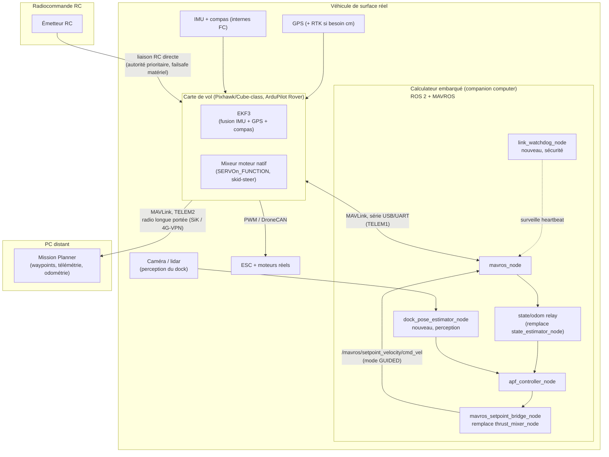
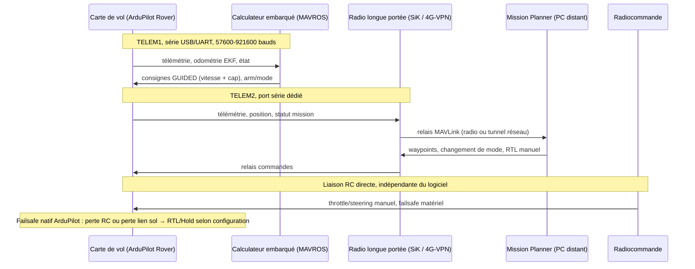
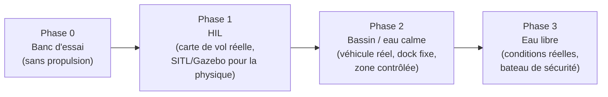

# Proposition d'architecture — migration vers un drone de surface réel

**Remplacement de Gazebo/VRX par un véhicule physique (ROS 2 + ArduPilot embarqués), avec station sol Mission Planner déportée**

Auteur : Yvan Eustache · Document généré le 2026-09-03 · Statut : **proposition, non implémentée**

> Ce document est un complément de [`ARCHITECTURE.md`](ARCHITECTURE.md), qui décrit l'état actuel (simulation Gazebo/VRX). Il propose la cible matérielle et logicielle pour faire fonctionner la même logique de docking (`vrx_apf_dock`) sur un **vrai véhicule de surface**, piloté par un **ArduPilot réel** (carte de vol physique), avec **Mission Planner sur un PC distant** pour la planification de mission et la réception de télémétrie/odométrie.

---

## 1. Résumé exécutif

Le système actuel repose entièrement sur Gazebo pour trois choses que le monde réel ne fournit plus gratuitement :

1. **La physique** (propulsion, hydrodynamique) — remplacée par de vrais moteurs/ESC pilotés par la carte de vol.
2. **Les capteurs** (IMU, odométrie « vérité terrain ») — remplacés par de vrais capteurs (IMU/GPS/compas de la carte de vol) fusionnés par l'EKF interne d'ArduPilot.
3. **La position du dock**, obtenue en simulation par un bridge Gazebo direct sur le second WAM-V — n'existe plus : il faut soit une position GPS relevée à l'avance (dock fixe), soit une **perception embarquée réelle** (caméra + marqueurs, lidar).

La recommandation centrale de ce document : **ne pas ré-implémenter en ROS 2 ce qu'ArduPilot fait déjà bien et de façon sûre** (fusion de capteurs, asservissement bas niveau des moteurs, failsafes). La pile `vrx_apf_dock` doit passer d'un rôle de « pilote complet » (calcule le cap, calcule la poussée, écrit directement sur les moteurs) à un rôle de **superviseur haut niveau** qui envoie des consignes de vitesse/cap à ArduPilot via MAVROS, pendant qu'ArduPilot conserve la responsabilité de la sécurité, de l'estimation d'état et de l'actionnement.

C'est le changement d'architecture le plus important de ce document — il conditionne presque toutes les recommandations qui suivent.

---

## 2. Ce qui disparaît, ce qui reste, ce qui est nouveau

| Composant simulation actuel | Devenir sur le véhicule réel |
|---|---|
| Gazebo (monde `sydney_regatta`, physique, spawn) | **Supprimé.** Aucun équivalent — remplacé par le monde réel. |
| `ros_gz_bridge` (odométrie GZ → ROS) | **Supprimé.** Remplacé par les topics natifs MAVROS (`/mavros/local_position/odom`, `/mavros/global_position/...`). |
| `ArduPilotPlugin` (lien FDM JSON, UDP loopback) | **Supprimé.** Remplacé par la liaison série réelle carte de vol ↔ calculateur embarqué. |
| `gz-sim-thruster-system` (physique de poussée) | **Supprimé.** Remplacé par le mixeur moteur natif d'ArduPilot (`SERVOn_FUNCTION`) + ESC réels. |
| `/model/wamv2/odometry` (pose « vérité terrain » du dock, gratuite en simulation) | **Supprimé — aucun équivalent réel.** Doit être remplacé par une **perception réelle** (voir §5). |
| `state_estimator_node` (intégration IMU maison) | **Fortement simplifié / retiré.** L'EKF d'ArduPilot (vrais GPS+IMU+compas) fournit une odométrie bien meilleure nativement. |
| `thrust_mixer_node` (2 PID maison → poussée directe) | **Retiré.** Remplacé par un nœud léger qui traduit `(v_cmd, θ_cmd)` en consigne MAVROS mode GUIDED — ArduPilot garde la main sur l'asservissement bas niveau. |
| `vector_marker_node`, `apf_field_marker_node`, `gz_marker_utils.py` (marqueurs gz-transport) | **Retirés en production**, conservés uniquement côté simulation pour le dev. Remplacés par des marqueurs RViz2 standards si un debug visuel embarqué est nécessaire. |
| `apf_lib.py` (`ApfDockController`, la loi APF elle-même) | **Conservé à l'identique.** C'est un algorithme pur, indépendant du capteur/actionneur — c'est justement la bonne nouvelle de cette architecture. |
| `apf_controller_node.py` | **Conservé, entrées/sorties adaptées** (consomme l'odométrie MAVROS réelle + la pose dock perçue, au lieu des topics simulés). |
| `joystick_setpoint_node` | **Rôle réduit.** N'écrit plus jamais directement sur des topics moteur — devient un déclencheur haut niveau (bascule de mode, arming) ; l'autorité de sécurité ultime passe à une **vraie radiocommande RC** branchée sur la carte de vol. |
| — | **Nouveau** : nœud de perception du dock (vision/fiducial ou position GPS pré-relevée). |
| — | **Nouveau** : routage MAVLink multi-client (calculateur embarqué ↔ Mission Planner distant). |
| — | **Nouveau** : surveillance de liaison (watchdog) calculateur ↔ ArduPilot, failsafes de mission. |
| `MisionPlanner/` (outil local, jamais câblé) | **Devient un composant actif de l'architecture**, déployé sur un PC distant, relié par liaison longue portée. |

---

## 3. Topologie matérielle cible



**Décisions clés de cette topologie :**

- **Deux liaisons MAVLink physiquement distinctes** partant de la carte de vol : `TELEM1` vers le calculateur embarqué (docking automatique), `TELEM2` vers une radio longue portée dédiée à Mission Planner. On évite ainsi de faire dépendre la liaison sol (supervision, arrêt d'urgence logiciel, RTL) du bon fonctionnement du calculateur ROS 2 — si celui-ci plante, l'opérateur au sol garde un lien direct vers ArduPilot.
- **La RC reste l'autorité de sécurité ultime**, câblée directement sur la carte de vol (failsafe matériel natif d'ArduPilot : perte de signal RC → RTL/Hold selon config), indépendamment de tout logiciel.
- **Le calculateur embarqué n'actionne jamais directement les moteurs** : il ne parle qu'à ArduPilot en MAVLink haut niveau (mode GUIDED), jamais aux ESC.

---

## 4. Repère et estimation d'état — remplacer l'odométrie simulée

En simulation, `state_estimator_node` compensait l'absence de capteur de vitesse par une intégration à fuite de l'IMU, et récupérait la pose du bateau et du dock directement depuis Gazebo (triche assumée et documentée). Sur le véhicule réel :

- **Position/vitesse du bateau** : consommer directement `/mavros/local_position/odom` (`nav_msgs/Odometry`, repère **ENU**, origine = point d'armement ou origine EKF) ou `/mavros/global_position/local`. Plus besoin d'intégration maison : l'EKF3 d'ArduPilot fusionne GPS + IMU + compas en continu, avec une bien meilleure robustesse (détection de divergence, failsafe GPS intégré).
- **Attention à la convention de repère** : MAVROS publie en **ENU** (Est-Nord-Haut) alors qu'ArduPilot travaille en interne en **NED**. `apf_lib.py` est agnostique au repère (il ne fait que de la géométrie 2D relative), mais `theta_dock` (cap) et les conversions quaternion↔yaw de `geometry_utils.py` doivent être vérifiées/testées avec la convention ENU de MAVROS avant transposition — c'est un point de non-régression à tester explicitement (le portage simulation → réel est l'endroit typique où une convention de signe de cap inversée passe inaperçue).
- **Précision requise pour le docking** : la loi APF actuelle vise `reached_radius ≈ 1 m`. Un GPS standard (2-3 m CEP) est **insuffisant** pour garantir cette précision de façon fiable, en particulier à proximité d'infrastructures (multi-trajets). Deux options, non exclusives :
  1. **GPS RTK** (fixe à terre + rover embarqué, ou service NTRIP) → précision centimétrique, mais nécessite une station de référence et une liaison de corrections (radio ou 4G/NTRIP).
  2. **Bascule vers la perception locale du dock** (caméra/lidar, §5) pour la phase d'approche finale uniquement — le GPS/EKF sert pour la navigation grossière (aller jusqu'à la zone du dock), la perception locale prend le relais pour l'alignement final. C'est l'approche recommandée : robuste même sans RTK, et cohérente avec le fait qu'un vrai dock n'émet pas sa position GPS.

---

## 5. Perception du dock réel

En simulation, la pose du dock était une vérité-terrain gratuite (`/model/wamv2/odometry`). Sur le terrain, il n'existe **aucun équivalent automatique** — il faut choisir explicitly une source :

| Option | Quand l'utiliser | Limites |
|---|---|---|
| **Position GPS pré-relevée** (dock fixe, coordonnées WGS84 relevées une fois, converties en repère local ENU) | Dock immobile, connu à l'avance, précision GPS/RTK suffisante | Ne s'adapte pas si le dock dérive (ponton flottant, marée, courant) ; ne fonctionne pas en environnement GPS dégradé |
| **Marqueurs fiduciaires (ArUco/AprilTag) + caméra embarquée** | Dock accessible visuellement, approche de jour, conditions de visibilité correctes | Sensible à la luminosité/météo ; portée de détection limitée (quelques mètres à quelques dizaines de mètres selon optique) |
| **Lidar + recalage de forme connue (ICP sur la géométrie du dock)** | Dock à géométrie caractéristique, besoin de robustesse jour/nuit | Coût matériel plus élevé, calcul plus lourd |

**Recommandation** : implémenter un nouveau nœud `dock_pose_estimator_node`, qui publie une `geometry_msgs/PoseStamped` sur `/vrx_apf_dock/dock/pose` — **exactement le même contrat d'interface** que ce que `state_estimator_node` publiait en simulation (pass-through de l'odométrie Gazebo du dock). C'est le point de conception le plus important de cette section : **en gardant la même interface ROS 2 en sortie, `apf_controller_node` et `apf_lib.py` n'ont besoin d'aucune modification** pour fonctionner sur le véhicule réel — seule la source de la pose change. Démarrer avec l'option GPS pré-relevé (la plus simple à mettre en œuvre) pour valider le reste de la chaîne, puis ajouter la perception visuelle pour la précision d'approche finale.

---

## 6. Chaîne de communication MAVLink réelle (multi-client)



**Points d'attention pour un architecte système :**

- **Ne pas faire transiter Mission Planner par le calculateur ROS 2** si on peut l'éviter : la solution à deux ports série physiques (TELEM1/TELEM2) ci-dessus est plus robuste qu'un relais logiciel unique (type `mavlink-router`/MAVProxy sur le calculateur embarqué), car elle élimine un point de défaillance commun entre docking automatique et supervision sol. Si la carte de vol ne dispose que d'un seul port série disponible, alors un relais logiciel (`mavlink-router`, recommandé plutôt que MAVProxy pour un usage embarqué headless) devient nécessaire sur le calculateur, avec les deux flux de sortie (MAVROS local + tunnel vers Mission Planner) — c'est un compromis à documenter explicitement comme dette technique si retenu.
- **Sécurisation de la liaison longue portée** : contrairement à la simulation (tout en boucle locale sur une seule machine), le lien vers Mission Planner traverse un support radio ou réseau potentiellement non maîtrisé. Activer le **signing MAVLink** (`MAV_SIGNING`, clé partagée) pour empêcher l'injection de commandes ; si la liaison passe par un réseau IP (4G, Wi-Fi), l'encapsuler dans un **VPN** (WireGuard typiquement) plutôt que d'exposer un port MAVLink UDP directement sur Internet.
- **Débit et fréquence de télémétrie** : Mission Planner et MAVROS n'ont pas besoin des mêmes fréquences de flux (`SR*_*` params ArduPilot) — dimensionner un flux allégé (position, statut) vers la radio longue portée bas débit, et un flux complet (attitude, capteurs bruts) vers MAVROS en local où la bande passante n'est pas contrainte.

---

## 7. Modifications logicielles par package

| Package / nœud | Action | Détail |
|---|---|---|
| `vrx_apf_dock/state_estimator_node.py` | **Retirer** | Remplacé par la consommation directe de `/mavros/local_position/odom`. La logique d'intégration à fuite IMU n'a plus de raison d'être. |
| `vrx_apf_dock/apf_lib.py` | **Conserver tel quel** | Aucune dépendance capteur/simulateur — c'est le composant le plus réutilisable de tout le projet. |
| `vrx_apf_dock/apf_controller_node.py` | **Adapter les entrées** | S'abonner à `/mavros/local_position/odom` (au lieu de `wamv/odom`) et à `/vrx_apf_dock/dock/pose` (désormais publié par `dock_pose_estimator_node`, §5) ; sortie `setpoint_apf` inchangée. |
| `vrx_apf_dock/thrust_mixer_node.py` | **Remplacer** | Nouveau nœud `mavros_setpoint_bridge_node` : traduit `(v_cmd, θ_cmd)` en `geometry_msgs/TwistStamped` sur `/mavros/setpoint_velocity/cmd_vel`, vérifie que le véhicule est **armé et en mode GUIDED** avant d'envoyer, sinon abstient (pas de PID maison, pas d'écriture moteur directe). |
| `vrx_apf_dock/vector_marker_node.py`, `apf_field_marker_node.py`, `gz_marker_utils.py` | **Retirer de la cible de production**, garder côté simulation | Dépendent de `gz.transport`, sans équivalent matériel réel. Remplaçables par des `visualization_msgs/MarkerArray` RViz2 si un besoin de debug visuel embarqué est confirmé. |
| `vrx_apf_dock_teleop/joystick_setpoint_node.py` | **Réduire le périmètre** | Ne publie plus jamais directement de commande moteur. Devient un déclencheur haut niveau : appelle `/mavros/set_mode` (bascule GUIDED ↔ HOLD) et republie éventuellement vers `mavros_setpoint_bridge_node` — jamais vers un topic moteur. |
| — (nouveau) `dock_pose_estimator_node` | **Créer** | Publie `/vrx_apf_dock/dock/pose`, même contrat d'interface que la simulation (§5). |
| — (nouveau) `link_watchdog_node` | **Créer** | Surveille le heartbeat MAVROS (`/mavros/state`) et l'âge des messages ; si le lien série ou le flux GPS/EKF se dégrade, force un repli sûr (bascule HOLD via `/mavros/set_mode`, ou laisse le failsafe natif ArduPilot agir en ne renouvelant plus les consignes GUIDED — voir §8). |
| `vrx_ardupilot/` (package spawn Gazebo) | **Retirer / remplacer** | Son unique rôle (spawn Gazebo + patch VRX) disparaît avec la simulation. Remplacé par un nouveau package `vrx_bringup` (ou équivalent) : lancement MAVROS avec `fcu_url` série réel, chargement des paramètres ArduPilot Rover (frame skid-steer, `SERVOn_FUNCTION`), diagnostics de démarrage (vérifie GPS fix, calibration compas, batterie avant d'autoriser l'armement). |
| `src/vrx`, `src/ardupilot_gazebo`, `ardupilot/` (dépôts amonts) | **Conserver en parallèle** | Ne pas supprimer l'environnement de simulation : il reste l'outil de non-régression pour `apf_lib.py` et de formation/répétition avant chaque campagne terrain (voir §9). |

---

## 8. Sécurité et failsafes

La simulation n'avait aucune conséquence physique en cas d'échec logiciel ; le véhicule réel en a. Points à câbler avant tout essai en eau libre :

- **Priorité RC absolue** : la radiocommande, câblée directement sur la carte de vol, doit toujours pouvoir reprendre la main (bascule manuelle) indépendamment de l'état du calculateur ROS 2 ou de la liaison Mission Planner. Configuration ArduPilot standard (`FS_THR_ENABLE`, mode de repli sur perte RC).
- **Watchdog du lien calculateur ↔ ArduPilot** : ArduPilot Rover ne bascule pas nativement en RTL sur la seule absence de nouvelles consignes GUIDED (contrairement à un failsafe RC ou batterie). Il faut donc que `link_watchdog_node` (ou `mavros_setpoint_bridge_node` lui-même) cesse d'émettre des consignes dès qu'il détecte une anomalie et **repasse explicitement en mode HOLD ou RTL** via `/mavros/set_mode` — ne pas compter sur un timeout implicite côté ArduPilot.
- **Geofence** : configurer une geofence ArduPilot (rayon max autour du point de lancement) — dernier filet de sécurité indépendant du code applicatif, actif même si toute la pile ROS 2 a un comportement inattendu.
- **Vérifications avant armement** : fix GPS, calibration compas, niveau de batterie, présence du lien Mission Planner — via les *arming checks* natifs d'ArduPilot (`ARMING_CHECK`), complétées si besoin par un service de pré-vol côté `vrx_bringup`.
- **Bouton d'arrêt d'urgence physique** : indépendant du logiciel (coupure moteur câblée), en complément du failsafe RC — recommandé pour tout essai avec du personnel à proximité.

---

## 9. Plan de migration en phases



| Phase | Objectif | Critère de sortie |
|---|---|---|
| **0 — Banc d'essai** | Valider le câblage FC/calculateur/ESC, MAVROS opérationnel, arming/désarmement, mixeur moteur ArduPilot, sans hélices/eau | Consignes GUIDED reçues et loguées correctement ; RC override fonctionnel |
| **1 — HIL (Hardware-In-the-Loop)** | Carte de vol réelle + calculateur réels, mais physique simulée (Gazebo/SITL en lieu du vrai véhicule) | `apf_controller_node`/`mavros_setpoint_bridge_node` pilotent un véhicule simulé via une vraie chaîne MAVLink matérielle |
| **2 — Bassin / zone contrôlée** | Premier docking réel, dock fixe, position GPS pré-relevée (option la plus simple du §5), personnel présent | Docking réussi de façon répétable, tous les failsafes testés manuellement (coupure RC, coupure lien) |
| **3 — Eau libre** | Conditions réelles (courant, houle légère), bateau de sécurité en accompagnement | Docking robuste sur plusieurs essais ; ajout éventuel de la perception visuelle (§5) si le GPS seul est insuffisant |

**Important** : l'environnement Gazebo/VRX actuel (`ARCHITECTURE.md`) n'est pas jeté après la migration — il reste l'outil de non-régression de `apf_lib.py` (phase 0-1) et le support d'entraînement/répétition avant chaque campagne terrain.

---

## 10. Table récapitulative des flux de communication (cible réelle)

| Source | Destination | Protocole / mécanisme | Données |
|---|---|---|---|
| Capteurs réels (GPS, IMU, compas) | Carte de vol (EKF3) | Bus interne carte de vol (I2C/SPI/UART selon capteur) | Mesures brutes |
| Carte de vol | Calculateur embarqué (MAVROS) | MAVLink, série USB/UART (TELEM1) | Odométrie EKF, état, heartbeat |
| Calculateur embarqué (`mavros_setpoint_bridge_node`) | Carte de vol | MAVLink (`SET_POSITION_TARGET_LOCAL_NED` / cmd_vel), mode GUIDED | Consigne vitesse + cap |
| Caméra/lidar | `dock_pose_estimator_node` | Interface capteur native (USB3, Ethernet...) | Image / nuage de points |
| `dock_pose_estimator_node` | `apf_controller_node` | Topic ROS 2 (`/vrx_apf_dock/dock/pose`) | Pose du dock perçue |
| Carte de vol | Radio longue portée → Mission Planner | MAVLink, série (TELEM2) puis radio/réseau | Télémétrie, position, statut |
| Mission Planner | Carte de vol | MAVLink (radio/réseau retour) | Waypoints, changement de mode, RTL manuel |
| Radiocommande | Carte de vol | Liaison RC directe (PPM/SBUS/liaison propriétaire) | Throttle/direction manuels, failsafe |
| Carte de vol (mixeur natif) | ESC / moteurs réels | PWM ou DroneCAN | Commande moteur |

---

## 11. Risques identifiés et mitigations

| Risque | Impact | Mitigation |
|---|---|---|
| GPS seul insuffisant pour la précision de docking (~1 m) | Échec/collision à l'approche finale | Perception locale (caméra/lidar, §5) pour la phase finale ; RTK si budget/infra le permettent |
| Perte du lien calculateur ↔ carte de vol pendant un docking automatique | Le véhicule continue sur la dernière consigne ou dérive sans supervision | `link_watchdog_node` + repli explicite en HOLD/RTL (§8), à tester systématiquement en phase 2 |
| Liaison Mission Planner exposée sur un support radio/réseau non maîtrisé | Interception ou injection de commandes | Signing MAVLink + VPN si liaison IP (§6) |
| Convention de repère ENU/NED mal transposée depuis la simulation | Cap/direction inversés au premier essai réel | Test unitaire dédié sur `geometry_utils.py` avec des données MAVROS réelles avant tout essai en eau |
| Dock non statique en réalité (dérive, marée) alors que la position GPS a été pré-relevée une fois | Approche vers une position obsolète | Passer à la perception visuelle dès que le dock n'est pas rigoureusement fixe |
| Gains APF (`c11, c12, c21, c22, safety_radius`) réglés en simulation, non transférables tels quels | Trajectoires trop agressives ou trop molles en réel | Re-réglage in situ en phase 2, en commençant par des gains réduits ; garder `plot_apf_field.py` comme outil de réglage |

---

## 12. Annexe — arborescence cible proposée

```
vrx_ws/
├── ARCHITECTURE.md, .pdf              ← état simulation (existant)
├── ARCHITECTURE_HARDWARE.md, .pdf     ← ce document
└── src/
    ├── vrx/, ardupilot_gazebo/,
    │   ardupilot/                     ← [conservés] non-régression sim
    ├── vrx_apf_dock/
    │   ├── apf_lib.py                 ← [inchangé]
    │   ├── apf_controller_node.py     ← [adapté] entrées MAVROS
    │   ├── mavros_setpoint_bridge_node.py
    │   │                              ← [nouveau] remplace thrust_mixer_node.py
    │   ├── dock_pose_estimator_node.py
    │   │                              ← [nouveau] perception du dock
    │   ├── link_watchdog_node.py      ← [nouveau] sécurité liaison
    │   └── (state_estimator_node.py, vector_marker_node.py,
    │        apf_field_marker_node.py, gz_marker_utils.py)
    │                                  ← [retirés en réel, gardés en sim]
    ├── vrx_apf_dock_teleop/
    │   └── joystick_setpoint_node.py  ← [réduit] déclencheur seulement
    └── vrx_bringup/                   ← [nouveau, remplace vrx_ardupilot/]
        ├── launch/vehicle_bringup.launch.py
        │                              (MAVROS + diagnostics démarrage)
        └── config/ardupilot_rover_real.yaml
```
