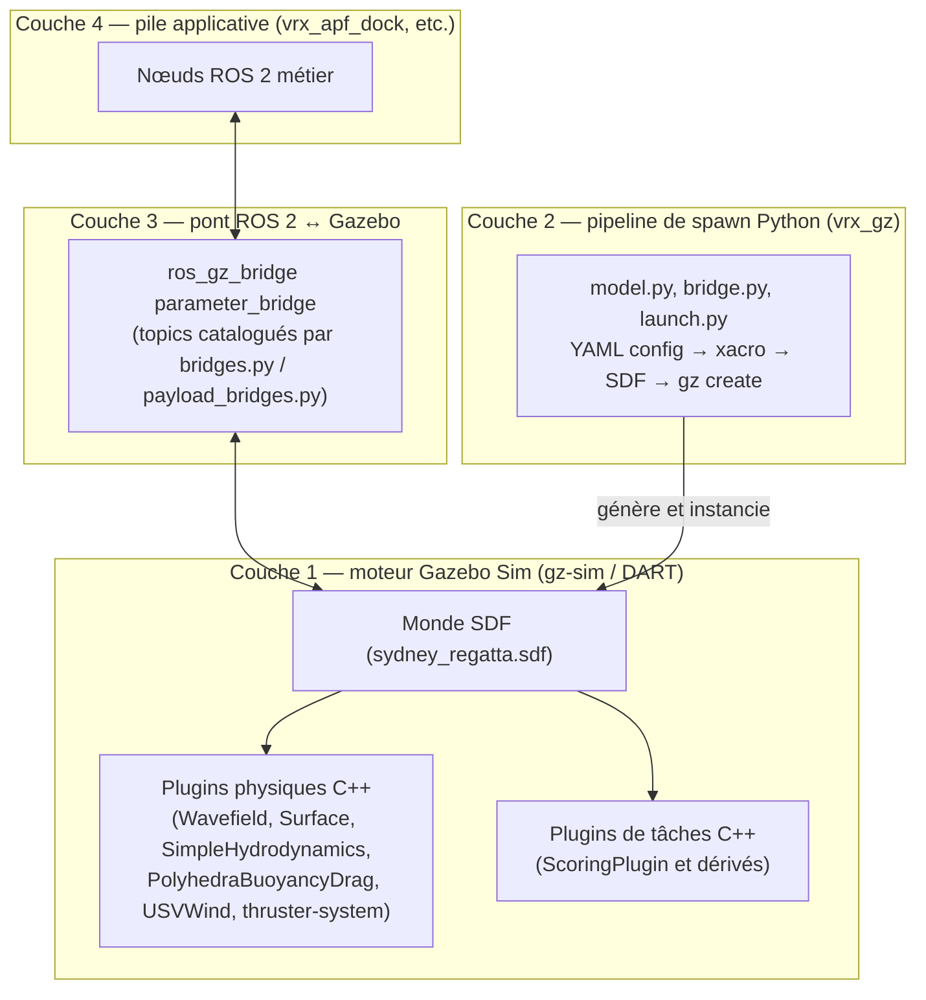
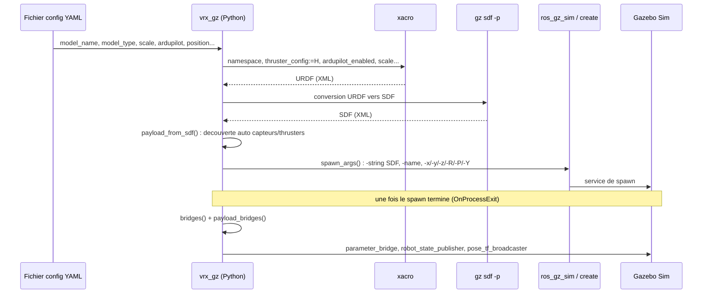
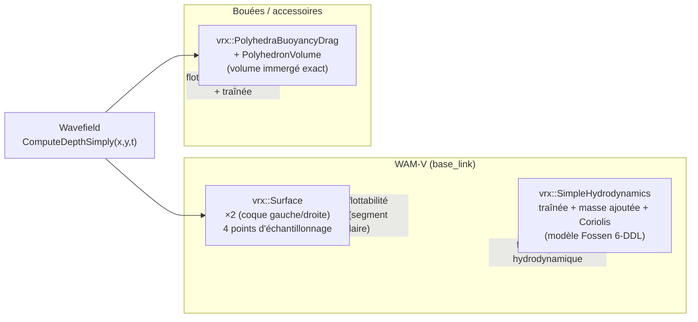
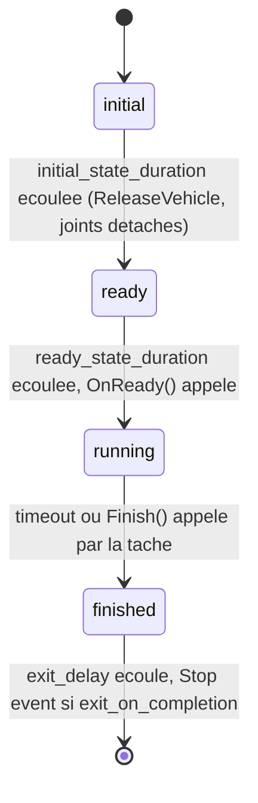

# Anatomie de VRX / Gazebo

**Comment fonctionne le simulateur sous le capot : environnement, physique, mécanique 3D, pipeline de spawn, pont ROS 2, tâches de compétition**

Auteur : Yvan Eustache · Document généré le 2026-09-03

> Ce document complète [`ARCHITECTURE.md`](ARCHITECTURE.md) (qui décrit `vrx_apf_dock`, la pile de commande construite *au-dessus* de VRX) et [`ARCHITECTURE_HARDWARE.md`](ARCHITECTURE_HARDWARE.md) (la migration vers un vrai véhicule). Ici, on ouvre le capot de **VRX lui-même** : `src/vrx` (upstream `osrf/vrx`, port Gazebo Sim / `gz-sim` — pas Gazebo Classic), packages `vrx_gz`, `vrx_urdf`, `vrx_ros`.

---

## 1. Vue d'ensemble — quatre couches



- **Couche 1** : le monde SDF et les plugins C++ compilés (`libSurface.so`, `libUSVWind.so`, ...) — c'est du Gazebo Sim pur, aucune dépendance ROS.
- **Couche 2** : un ensemble de scripts Python (`vrx_gz/src/vrx_gz/`) qui **génèrent** le SDF du véhicule à partir de xacro et **déclarent** les bridges — c'est de la génération de configuration, pas du run-time.
- **Couche 3** : `ros_gz_bridge` fait le pont topic-à-topic entre `gz-transport` et ROS 2 — c'est la seule couche que voit le code applicatif.
- **Couche 4** : votre code (`vrx_apf_dock`, etc.), documenté dans `ARCHITECTURE.md`.

---

## 2. Pipeline de spawn — d'un fichier YAML à un véhicule dans Gazebo



### 2.1 La classe `Model` (`vrx_gz/src/vrx_gz/model.py`)

C'est le cœur de tout le pipeline. Un objet `Model` porte `model_name`, `model_type` (`usv`/`wam-v` vs `vrx_hexrotor`/`vrx_quadrotor` → `is_UAV()`/`is_USV()`), `position`, `scale`, `ardupilot`, `payload`.

- **`xacro_cmd()`** construit l'appel `xacro` : `namespace:=<model_name>`, `locked:=true`, `imu_enabled:=true` (uniquement si `vrx_sensors_enabled:=false`, sinon la macro IMU serait instanciée deux fois — piège xacro documenté dans le code), **`thruster_config:=H` toujours**, y compris en mode ArduPilot (`ArduPilotPlugin` publie sur les mêmes topics que le thruster-system standard plutôt que de le remplacer, cf. `ARCHITECTURE.md` §7.2), `ground_truth_enabled:=true`, `ardupilot_enabled:=true` si applicable, `scale:=<scale>` pour les USV.
- **`generate()`** exécute xacro, convertit le résultat URDF en SDF via `gz sdf -p`, et appelle **`payload_from_sdf()`** : parcourt le SDF généré (via `sdformat14`) et **découvre automatiquement** tous les capteurs (`<sensor>`) et plugins connus (`gz::sim::systems::Thruster`, `JointPositionController`) pour peupler `self.payload` — c'est ce mécanisme qui permet à `vrx_apf_dock`, sans rien déclarer manuellement, de voir apparaître les bons bridges de capteurs.
- **`spawn_args()`** ne fait *pas* un appel `gz service` brut : c'est un nœud `ros_gz_sim`/`create` standard (`-string <SDF>`, `-name`, `-x/-y/-z/-R/-P/-Y`).
- **`FromConfig(stream)`** parse le YAML (`yaml.safe_load`), liste ou dict unique. Clés : `model_name`, `model_type` (requis), `position.xyz`/`rpy`, `scale`, `ardupilot` (USV), `flight_time`, `payload` (UAV).

### 2.2 `bridge.py` — la primitive de bridging

`Bridge(gz_topic, ros_topic, gz_type, ros_type, direction)`, `direction ∈ {BIDIRECTIONAL, GZ_TO_ROS, ROS_TO_GZ}`. `.argument()` génère l'argument CLI exact consommé par `ros_gz_bridge parameter_bridge` (ex. `/model/wamv/odometry@nav_msgs/msg/Odometry[gz.msgs.Odometry`), `.remapping()` permet de renommer le topic côté ROS (c'est ainsi qu'un chemin gz-transport verbeux devient `sensors/imu/imu/data`).

### 2.3 `bridges.py` / `payload_bridges.py` — le catalogue

Deux familles de bridges :

**Par véhicule** (`Model.bridges()`, toujours présents) :

| Bridge | Topic GZ | Topic ROS | Sens |
|---|---|---|---|
| `pose` | `/model/{m}/pose` | `pose` (`tf2_msgs/TFMessage`) | GZ→ROS |
| `pose_static` | `/model/{m}/pose_static` | `pose_static` | GZ→ROS |
| `joint_states` | `/world/{w}/model/{m}/joint_state` | `joint_states` | GZ→ROS |
| `cmd_vel` (UAV seulement) | `/model/{m}/cmd_vel` | `cmd_vel` | ROS→GZ |
| `magnetometer`/`air_pressure` (UAV) | `.../sensor/.../{type}` | `magnetic_field`/`air_pressure` | GZ→ROS |

**Par capteur/payload découvert** (`payload_bridges()`, dispatché sur le type `sdf.Sensortype` ou une sous-chaîne du nom du plugin) :

| Type détecté | Topic ROS | Message |
|---|---|---|
| `IMU` | `sensors/imu/imu/data` | `sensor_msgs/Imu` |
| `NAVSAT` (GPS) | `sensors/gps/gps/fix` | `sensor_msgs/NavSatFix` |
| `CAMERA`/`RGBD_CAMERA` | `sensors/cameras/{name}/image_raw` (+ `camera_info`, `depth`) | `sensor_msgs/Image`... |
| `GPU_LIDAR` | `sensors/lidars/{name}/scan`/`points` | `LaserScan`/`PointCloud2` |
| `CONTACT` | `/vrx/contacts` | `ros_gz_interfaces/Contacts` |
| nom contient `'OdometryPublisher'` | `sensors/position/ground_truth_odometry` | `nav_msgs/Odometry` |
| nom contient `'thruster_thrust_'` | `thrusters/{side}/thrust` | `std_msgs/Float64` (ROS→GZ) |
| nom contient `'AcousticPinger'` | `sensors/acoustics/receiver/range_bearing` | `ros_gz_interfaces/ParamVec` |

**Globaux/compétition** (`competition_bridges()`, un seul `parameter_bridge` pour tous) : `clock`, `task_info` (`/vrx/task/info`), et selon le monde (listes `STATIONKEEPING_WORLDS`, `WILDLIFE_WORLDS`, etc.) les topics spécifiques à la tâche (`stationkeeping/goal`, `wildlife/animal{i}/pose`, `wayfinding/waypoints`...).

> ⚠️ **Incohérence de nommage repérée** : `AcousticTrackingScoringPlugin` publie par défaut sur `/vrx/acoustic_wayfinding/pose_error` (nom historique, côté C++), alors que `bridges.py` déclare `/vrx/acoustic_tracking/pose_error` côté ROS — les deux ne coïncident que si le monde SDF surcharge explicitement `<pose_error_topic>` sur le plugin. À vérifier avant de compter sur ce bridge.

### 2.4 Séquencement du lancement (`launch.py`, `competition.launch.py`)

`competition.launch.py` expose `world`, `sim_mode` (`full`/`sim`/`bridge`), `config_file`, `headless`, `competition_mode` (désactive les topics de debug comme le vent). Séquence : `simulation()` démarre `gz sim` (+ un processus `monitor_sim.py` qui est un **simple watchdog** — il fait `pgrep -f "gz sim"` toutes les secondes et déclenche l'arrêt de tout l'arbre de lancement ROS 2 quand Gazebo se termine, **ce n'est pas un moniteur de score**) → `spawn()` spawn le(s) modèle(s) puis, **après confirmation de fin du spawn** (`OnProcessExit`), lance le `parameter_bridge` + `robot_state_publisher` + `pose_tf_broadcaster` → `competition_bridges()` ajoute les topics globaux.

---

## 3. Modélisation de l'environnement

### 3.1 Le champ de vagues (`Wavefield.cc`) — pas un plugin, un moteur de calcul partagé

`vrx::Wavefield` n'est pas un `System` Gazebo : c'est une classe C++ instanciée *à l'intérieur* d'autres plugins (`Surface`, `PolyhedraBuoyancyDrag`, `WaveVisual`). Porté de [`srmainwaring/asv_wave_sim`](https://github.com/srmainwaring/asv_wave_sim). Deux modes : lecture directe d'un bloc `<wavefield>` SDF, ou **abonnement à un topic `gz.msgs.Param`** (`/vrx/wavefield/parameters` par défaut) — c'est ce second mode qu'utilise `sydney_regatta.sdf` (voir §3.3).

**Deux modèles de spectre** (paramètre `model`) :
- **PMS** (Pierson-Moskowitz, par défaut) : spectre océanique réaliste, `Pm(ω,ωp) = α·g²/ω⁵ · exp(−5/4·(ωp/ω)⁴)` avec `α = 0.0081`. Les amplitudes des composantes sont échantillonnées autour de la fréquence moyenne.
- **CWR** (Constant Wavelength-Amplitude Ratio) : composantes générées par un simple ratio d'échelle géométrique entre elles.

**Hauteur d'eau en un point (x,y,t)** — c'est la fonction appelée à **chaque pas de physique** par `Surface` et `PolyhedraBuoyancyDrag` :

```
h(x,y,t) = Σᵢ aᵢ·cos(kᵢ·(x·dxᵢ + y·dyᵢ) − ωᵢ·t) · (1 − exp(−(t−t₀)/τ))
```

— une simple **superposition de sinusoïdes** (relation de dispersion en eau profonde `ω = √(g·k)`), avec une **montée en puissance exponentielle** au démarrage (`τ`, défaut 2 s) pour éviter un à-coup. Une seconde méthode (`ComputeDepthDirectly`) résout la **houle de Gerstner complète** (déplacement horizontal des particules, pas seulement vertical) par une résolution de Newton 2D — plus fidèle mais plus coûteuse, non utilisée dans la boucle physique par défaut.

**Paramètres SDF clés** : `number` (composantes, ≤3), `scale` (rapport plus grande/plus petite composante, 1.1), `angle` (étalement directionnel, 0.4 rad), `steepness` (cambrure Gerstner 0-1), `period` (5 s), `direction`, `gain` (multiplicateur d'amplitude PMS).

### 3.2 `WaveVisual` — le rendu, découplé de la physique

`WaveVisual` instancie **sa propre copie** de `Wavefield` (abonnée au même topic) uniquement pour extraire les paramètres numériques et les envoyer comme **uniforms de shader GPU** (Ogre2 : `Nwaves`, `amplitude[3]`, `wavenumber[3]`, `omega[3]`, `steepness[3]`...) — le maillage océan à l'écran est déformé sur GPU indépendamment du calcul physique CPU. Les deux restent cohérents parce qu'ils partagent le même flux de paramètres, mais **ce n'est pas la même exécution de code** — une divergence de shader n'affecterait jamais la physique, et vice-versa.

### 3.3 Configuration réelle dans `sydney_regatta.sdf`

- **Moteur physique** : `<physics type="dart">`, `max_step_size = 0.004 s` (**250 Hz**), `real_time_factor = 1.0`.
- **Plugins chargés au niveau du monde** : les systèmes `gz-sim-*-system` standards (physics, sensors avec `render_engine=ogre2`, imu, magnetometer, forcetorque, scene-broadcaster, contact, navsat, particle-emitter, user-commands) **plus** `libUSVWind.so` et `libPublisherPlugin.so` (celui-ci publie les paramètres du champ de vagues, voir ci-dessous). Aucun plugin de flottabilité au niveau monde — `Surface`/`SimpleHydrodynamics` viennent du SDF généré du WAM-V lui-même, `PolyhedraBuoyancyDrag` est attaché individuellement à chaque bouée `<include>`.
- **⚠️ Par défaut, l'eau est calme et le vent est coupé** : `libPublisherPlugin.so` publie sur `/vrx/wavefield/parameters` avec **`gain = 0.0`** (donc amplitude de vague nulle, quel que soit `period`/`steepness` configurés), et `USVWind` est instancié avec **`wind_mean_velocity = 0.0`** et **`var_wind_gain_constants = 0`** (pas de rafales). Pour tester la robustesse de `vrx_apf_dock` en conditions dégradées, c'est **ici** qu'il faut agir (voir tableau §8).
- **Géoréférencement** : `<spherical_coordinates>` avec les coordonnées réelles du plan d'eau de Sydney Regatta (`-33.724223, 150.679736`, WGS84/ENU) — c'est ce qui permet à un GPS simulé de renvoyer des coordonnées cohérentes.
- Les mondes `2023_practice/` et `2023_phase2/` (variantes numérotées par tâche : `wildlife0-5`, `stationkeeping0-5`, `scan_dock_deliver0-5`...) partagent **exactement** ce même socle physique/environnement — seules les positions des accessoires/bouées et la config du plugin de scoring changent.

### 3.4 Le vent (`USVWind.cc`) — modèle de rafales de Gauss-Markov

Plugin **de niveau monde**, ciblant une liste de `<wind_obj>` (modèle + lien + `coeff_vector`). Modèle de rafale (bruit coloré, processus de type Ornstein-Uhlenbeck discrétisé) :

```
filterGain = gainConstant·√(2·timeConstant)
varVel += (1/timeConstant)·(−varVel + filterGain/√dt·N(0,1))·dt      # à chaque pas
velocity = varVel + windMeanVelocity
```

Puis force de traînée **quadratique**, signée : `Fx = coeff.x·relVel.x·|relVel.x|`, `Fy = coeff.y·relVel.y·|relVel.y|`, et un couple de lacet parasite `τz = −2·coeff.z·relVel.x·relVel.y` — un vent de travers génère donc aussi un couple de lacet, pas seulement une dérive latérale. Dans `sydney_regatta.sdf`, le seul objet vent configuré cible `wamv/base_link` avec `coeff_vector = (0.5, 0.5, 0.33)`.

---

## 4. Physique du véhicule — trois plugins, deux usages différents



### 4.1 `Surface` — flottabilité du WAM-V (approximation cylindrique par coque)

Chaque coque du catamaran est modélisée comme un **cylindre horizontal** (`hull_length = 4.9·scale` m, `hull_radius = 0.213·scale` m), échantillonné en **2 points** (avant/arrière) — soit **4 points au total** pour tout le WAM-V (2 coques × 2 points). Pour chaque point : profondeur d'eau locale via `Wavefield::ComputeDepthSimply`, puis force de flottabilité par l'aire du **segment circulaire** immergé :

```
CircleSegment(r,h) = r²·acos((r−h)/r) − (r−h)·√(2rh − h²)
F = CircleSegment(hull_radius, deltaZ) · hull_length/nb_points · (−gravity.Z) · fluid_density
```

Toujours positive (poussée vers le haut uniquement) — c'est un modèle **simplifié**, sans traînée ni couple propre (la traînée/inertie vient du plugin suivant).

### 4.2 `SimpleHydrodynamics` — traînée, masse ajoutée, couplage de Coriolis

Modèle 6 degrés de liberté d'après **Fossen, *Guidance and Control of Ocean Vehicles***, appliqué au `base_link` entier. Trois contributions sommées en repère corps puis ramenées en repère monde :

- **Masse ajoutée** : `F_am = −Ma·stateDot` (Ma diagonale : `xDotU, yDotV, zDotW, kDotP, mDotQ, nDotR`).
- **Couplage de Coriolis** (termes croisés surge/sway ↔ lacet) : `C(0,5)=C(5,0)=yDotV·v`, `C(1,5)=C(5,1)=xDotU·u`.
- **Traînée linéaire + quadratique**, par axe : `D(i,i) = paramLinéaire + paramQuad·|vitesse_i|`.

**Valeurs réellement utilisées pour le WAM-V** (`wamv_gazebo_dynamics_plugin.xacro`, mises à l'échelle en `scale²` — approximation « aire mouillée/frontale », pas un vrai scaling de Froude) :

| Paramètre | Valeur (×scale²) | Axe |
|---|---|---|
| `xU` / `xUU` | 100 / 150 | surge (avance) |
| `yV` / `yVV` | 100 / 100 | sway (dérive latérale) |
| `zW` | 500 | heave (pilonnement) |
| `kP` / `kPP` | 300 / 600 | roll |
| `mQ` / `mQQ` | 900 / 900 | pitch |
| `nR` / `nRR` | 800 / 800 | yaw (lacet — c'est ce terme qui amortit la rotation commandée par `thrust_mixer_node`/ArduPilot) |

### 4.3 `PolyhedraBuoyancyDrag` — flottabilité exacte pour les bouées/accessoires

Contrairement à `Surface` (approximation cylindrique dédiée au WAM-V), ce plugin calcule le **volume immergé exact** d'un polyèdre (boîte/sphère/cylindre) contre le plan d'eau local, par découpage géométrique — méthode d'**Erin Catto** (*Exact Buoyancy for Polyhedra*, Game Programming Gems 6). `PolyhedronVolume::SubmergedVolume()` triangule la forme, classe chaque face (immergée/sèche/coupée), et découpe les faces coupées en tétraèdres dont on somme les volumes signés (produit triple).

```
F_buoyancy = −fluid_density · volume_immergé · gravité
F_drag     = linear_drag · (masse · volume_immergé/volume_total) · (vitesse_eau − vitesse_objet)
```

Utilisé pour **toutes** les bouées de navigation (`mb_marker_buoy_*`, `mb_round_buoy_*`), pas pour le WAM-V.

---

## 5. Fichiers de définition mécanique 3D (xacro/URDF)

### 5.1 Coque — `wamv_base.urdf.xacro`

Un seul lien rigide `base_link` : visuel = maillage Collada unique, **collision décomposée** en primitives (6 cylindres de coque, 12 cylindres d'entretoises, 2 boîtes de jonction, 1 boîte de pont — bien moins coûteux pour le moteur physique qu'un maillage exact). Masse/inertie **mises à l'échelle selon les lois physiques dimensionnelles** :

```
masse   = 180·scale³     (volume ~ échelle³, densité uniforme supposée)
ixx/iyy/izz = {120, 393, 446}·scale⁵   (inertie ~ masse × longueur² ~ échelle⁵)
```

Cette même loi (`masse~scale³`, `inertie~scale⁵`) s'applique aux batteries (`23.5·scale³` kg), aux moteurs (`15·scale³` kg) et aux hélices (`0.5·scale³` kg) — c'est ce qui rend le « mini WAM-V » (`scale: 0.5`, utilisé pour le robot dans `two_wamv.yaml`) physiquement cohérent, pas juste visuellement réduit. `<enable_wind>true</enable_wind>` marque le lien comme sensible au plugin `USVWind`.

### 5.2 Batteries — `battery.xacro`

Masse ponctuelle articulée en joint fixe sur `base_link` (deux instances, `±1·scale` en y) — contribue à la masse/inertie totale du véhicule au niveau du moteur physique (les joints fixes sont fusionnés), sans lien physique dédié dans la logique de contrôle.

### 5.3 Layouts de propulseurs — `wamv_gazebo/urdf/thruster_layouts/`

| Layout | Propulseurs | Configuration physique |
|---|---|---|
| **`H`** (défaut) | 2 arrière (`left`/`right`), fixes | Poussée différentielle pure — c'est le layout utilisé par `thrust_mixer_node` (§4.4 de `ARCHITECTURE.md`) et **aussi par ArduPilot** (`model.py` force `thruster_config:=H` même en mode ArduPilot) |
| **`T`** | 2 arrière + 1 latéral (`yaw=90°`) | Ajoute une translation latérale directe |
| **`X`** | 4 propulseurs à 45° (2 avant + 2 arrière) | Configuration vectorisée, contrôle quasi-holonome (surge/sway/yaw indépendants) |
| **`ArduPilot`** (`wamv_aft_thrusters_ardupilot.xacro`) | Mêmes positions que `H`, **sans** le plugin `gz-sim-thruster-system` | **Code mort actuellement** : abandonné au profit du mode `COMMAND` d'`ArduPilotPlugin` qui réutilise le layout `H` standard (cf. `ARCHITECTURE.md` §7.2) |

### 5.4 Moteur/hélice — `thrusters/engine.xacro`

Chaque propulseur = 2 liens (`{prefix}_engine_link`, `{prefix}_propeller_link`) + 2 joints :
- **`{prefix}_chassis_engine_joint`** (revolute, axe Z, ±π) — le joint d'**azimut/direction** (utilisé par les layouts vectorisés type `X`).
- **`{prefix}_engine_propeller_joint`** (continuous, axe X, friction/damping 0.05) — le joint de **rotation de l'hélice**, celui que le plugin `gz-sim-thruster-system` commande réellement en vitesse angulaire pour produire la poussée (voir `wamv_gazebo_thruster_config.xacro`, déjà documenté dans `ARCHITECTURE.md` §4.5 / §7.2).

---

## 6. Plugins de tâches de compétition (scoring)

VRX est avant tout un simulateur de **compétition** (RobotX/RoboBoat) : chaque monde de tâche instancie un plugin dérivé de `ScoringPlugin`, qui implémente une machine à états commune.



Publication commune (1 Hz) sur `/vrx/task/info` (`gz.msgs.Param` → ROS `ros_gz_interfaces/ParamVec`) : `state`, `elapsed_time`, `remaining_time`, `num_collisions`, `score`. Les collisions sont comptées via un abonnement à `/vrx/contacts`, avec un `collision_buffer` anti-rebond.

| Plugin | Tâche modélisée | Signal(aux) spécifique(s) |
|---|---|---|
| `StationkeepingScoringPlugin` | Maintenir position/cap sur un point fixe | `.../goal`, `.../pose_error`, `.../mean_pose_error` |
| `NavigationScoringPlugin` | Traverser un chenal de portes (paires de bouées) | Points par porte + bonus d'enchaînement, pénalité de collision |
| `WildlifeScoringPlugin` | Éviter/contourner des bouées-animaux (sens horaire/anti-horaire) | `.../animal{i}/pose` (1 Hz) |
| `GymkhanaScoringPlugin` | Composite : chenal + recherche par pinger acoustique | Délègue à des instances internes de `NavigationScoringPlugin`/`StationkeepingScoringPlugin` |
| `ScanDockScoringPlugin` | Lire une séquence de couleurs, docker dans la bonne baie, tirer une balle | `color_sequence` (ROS→GZ, soumission du concurrent), `symbol_topic` par baie |
| `PerceptionScoringPlugin` | Identifier/localiser des objets apparus en scène | `landmark` (ROS→GZ, soumission du concurrent) |
| `AcousticTrackingScoringPlugin` | Suivre un pinger acoustique mobile | Même schéma pose-erreur que Stationkeeping, mais cible mobile (⚠️ voir incohérence de topic §2.3) |
| `AcousticPerceptionScoringPlugin` | Homing vers un pinger fixe (tolérance 1 m) | S'appuie sur `AcousticPingerPlugin` |

**Plugins auxiliaires** (accessoires, pas de scoring propre) : `AcousticPingerPlugin` (capteur portée/relèvement bruité), `LightBuoyPlugin`/`PlacardPlugin` (affichage couleur/symbole), `BallShooterPlugin` (lanceur à ressort, 250 N par défaut), `WaypointMarkers` (marqueurs de visualisation Gazebo, même mécanisme `/marker_array` que `vector_marker_node` — voir `ARCHITECTURE.md` §4.5).

**Pertinence pour `vrx_apf_dock`** : ces plugins ne sont pas utilisés par le projet de docking actuel, mais `StationkeepingScoringPlugin` en particulier est un bon gabarit si l'on veut un jour **chronométrer/scorer automatiquement** un essai de docking (temps, précision finale, nombre de collisions) plutôt que de le juger à l'œil en simulation.

---

## 7. Liens avec ROS 2 et ArduPilot — synthèse

- **ROS 2** : jamais de dépendance directe entre les plugins C++ Gazebo et ROS — tout passe par `ros_gz_bridge` (couche 3, §1), déclaré dynamiquement par les scripts Python de la couche 2. C'est pour cela qu'ajouter un capteur au WAM-V (un xacro de plus dans `wamv_gazebo.urdf.xacro`) suffit à le faire apparaître côté ROS **sans toucher au pipeline de spawn** : `payload_from_sdf()` le détecte automatiquement.
- **ArduPilot** : ne passe *pas* par cette couche de bridging du tout — `ArduPilotPlugin` (package `ardupilot_gazebo`, documenté dans `ARCHITECTURE.md` §7) communique en JSON/UDP direct avec Gazebo (lien FDM), et publie sa commande de poussée en mode `COMMAND` sur les **mêmes topics gz-transport natifs** que le plugin `gz-sim-thruster-system` (`wamv/thrusters/{left,right}/thrust`) — du point de vue de VRX, ArduPilot est indiscernable d'un nœud ROS qui publierait sur ces topics.
- **Environnement (vagues/vent)** : aujourd'hui **désactivé** dans le monde utilisé par `vrx_apf_dock`/`vrx_ardupilot` (`gain=0`, `wind_mean_velocity=0`). C'est un choix de simplification pour le développement du docking, mais cela signifie que **la robustesse de la loi APF aux perturbations n'a jamais été testée en simulation** — voir chapitre proposé §9.3.

---

## 8. Paramètres clés à modifier — aide-mémoire pratique

| Je veux... | Fichier | Paramètre |
|---|---|---|
| Activer de la houle | `sydney_regatta.sdf` (bloc `PublisherPlugin`) | `gain` (0 → ex. 0.5), `period`, `steepness` |
| Activer du vent avec rafales | `sydney_regatta.sdf` (bloc `USVWind`) | `wind_mean_velocity`, `var_wind_gain_constants` |
| Changer la taille du WAM-V | fichier de config de spawn (ex. `two_wamv.yaml`) | `scale` |
| Changer le nombre/agencement des propulseurs | `wamv_gazebo.urdf.xacro` (arg passé par `model.py`) | `thruster_config` (`H`/`T`/`X`) |
| Régler l'amortissement en lacet (yaw) du bateau | `wamv_gazebo_dynamics_plugin.xacro` | `nR`/`nRR` (`SimpleHydrodynamics`) |
| Réduire le pas de physique (précision ↑, coût CPU ↑) | `sydney_regatta.sdf` (`<physics>`) | `max_step_size` (défaut 0.004 s) |
| Accélérer/ralentir la simulation par rapport au temps réel | `sydney_regatta.sdf` (`<physics>`) | `real_time_factor` |
| Ajouter un capteur (caméra, lidar...) au WAM-V | xacro de capteur (`wamv_gazebo/urdf/components/`) inclus dans `wamv_gazebo.urdf.xacro` | — (bridge auto-découvert, voir §2.1) |
| Lancer sans rendu (calcul plus rapide, pas de GUI/markers) | argument de lancement | `headless:=true` |
| Scorer automatiquement un run (temps, précision, collisions) | nouveau plugin inspiré de `StationkeepingScoringPlugin` | `<running_state_duration>`, `<collision_buffer>` |

---

## 9. Chapitres additionnels proposés

Ce document couvre le socle demandé ; plusieurs sujets connexes mériteraient un chapitre dédié si le besoin se présente :

1. **Génération procédurale des mondes de tâche** (`2023_phase2/`, `2023_practice/`) — comment les 6 variantes numérotées par tâche sont dérivées (positions de bouées, seed aléatoire), et comment en générer une nouvelle pour un scénario de docking spécifique.
2. **Performance et temps réel** — coût du pas de physique à 250 Hz, impact du rendu Ogre2/`headless`, comment profiler un monde qui tourne sous le `real_time_factor` cible (pertinent avant tout essai HIL, cf. `ARCHITECTURE_HARDWARE.md` phase 1).
3. **Robustesse aux perturbations environnementales** — activer vent/houle (§8) et quantifier la dégradation de la précision de docking de `apf_lib.py`, aujourd'hui jamais testée puisque l'environnement par défaut est calme.
4. **Ajouter un nouveau type de véhicule** — ce que `is_UAV()`/`is_USV()` et le pipeline de spawn supposent en dur, et ce qu'il faudrait généraliser pour un véhicule hors catalogue (ex. un ROV).
5. **Debug et introspection Gazebo** — `gz topic -e`/`gz service -l`, lecture des marqueurs `/marker_array`, comment tracer une force appliquée par un plugin (`SimpleHydrodynamics`, `USVWind`) pour diagnostiquer un comportement physique inattendu.
6. **Créer un nouveau plan d'eau géoréférencé** — utiliser `<spherical_coordinates>` pour faire correspondre un monde Gazebo à un vrai plan d'eau (utile en amont d'un essai réel, cf. `ARCHITECTURE_HARDWARE.md` §9 phase 2/3).
7. **Le pont gz-transport natif vs `ros_gz_bridge`** — pourquoi `vector_marker_node`/`apf_field_marker_node` contournent délibérément le bridge (service `/marker_array`, sans équivalent ROS), et dans quels autres cas parler gz-transport directement est préférable à passer par ROS 2.
8. **Tests et CI du dépôt VRX amont** (`.github/workflows`) — ce qui est testé automatiquement en amont, utile pour juger si un patch local (cf. `ARCHITECTURE.md` §7.2) risque de casser au prochain `git pull` upstream.
