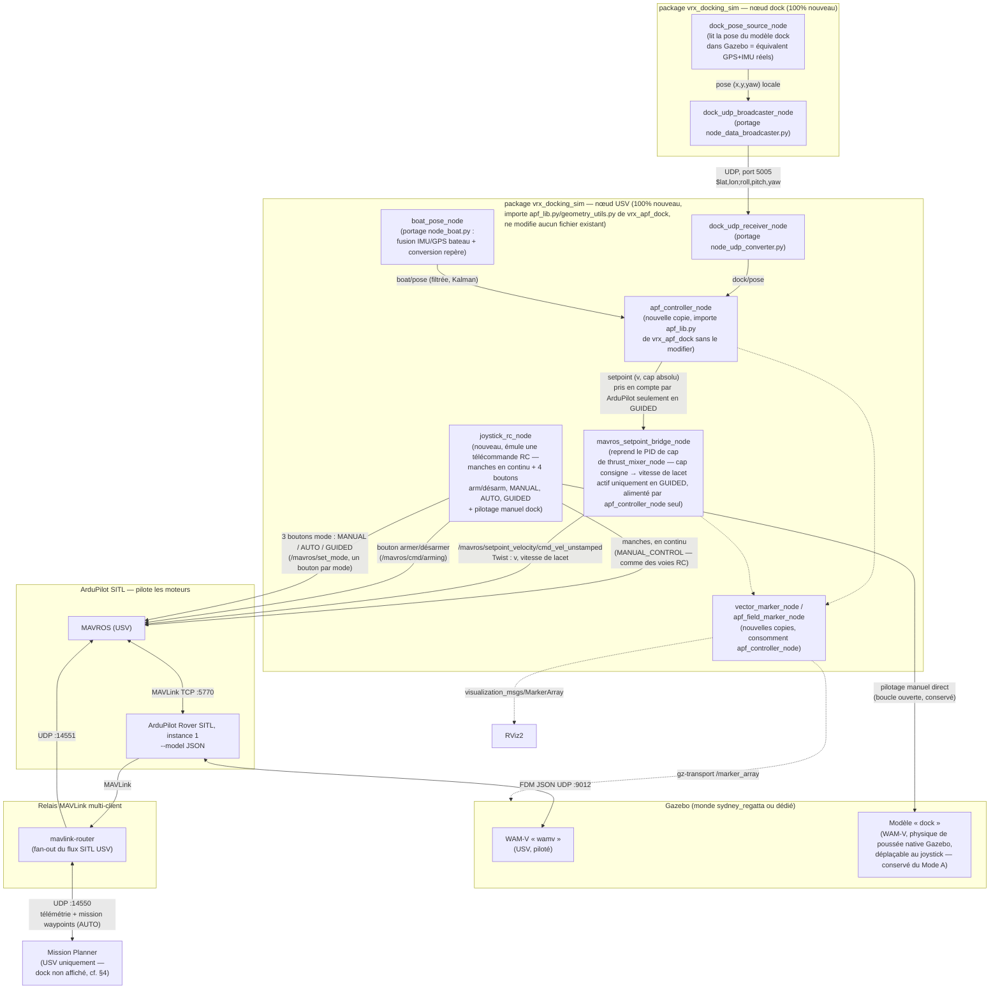

# Proposition — Simulateur de docking complet (ArduPilot SITL + dock UDP réel + Mission Planner + joystick + vecteurs)

Auteur : Claude (assistant) · Document généré le 2026-09-08, mis à jour le 2026-09-08 après arbitrages · Statut : **proposition, non implémentée — arbitrages validés ci-dessous, prête à passer en développement**

## 0. Arbitrages validés

| Question | Décision |
|---|---|
| Mode A (poussée directe maison) vs Mode C (ArduPilot pilote les moteurs) | **Mode C remplace le Mode A.** `thrust_mixer_node` n'est plus utilisé en production ; conservé uniquement comme outil de non-régression hors ArduPilot si besoin. |
| Protocole UDP dock → USV | **Fidèle à `guerledocking`** : trame ASCII `"$lat,lon;roll,pitch,yaw"`, port 5005 (IP/port paramétrés au lieu d'être codés en dur). |
| Représentation du dock dans Mission Planner | **Reportée — hors périmètre pour l'instant.** Mission Planner n'affiche que l'USV. `dock_mavlink_emitter_node` (2ᵉ véhicule MAVLink) n'est **pas implémenté** dans cette première version ; voir §4. |
| Rôle de Mission Planner | **Définition de la mission** (waypoints, chargés dans ArduPilot) **+ visualisation position/attitude de l'USV** — c'est un poste de planification/supervision du trajet global, pas un outil de docking. |
| Modes ArduPilot pilotés depuis le joystick | **Le joystick reproduit une vraie télécommande RC**, pas une logique ROS de deadman/arbitrage : les manches transmettent en continu une consigne manuelle (comme des voies RC en permanence actives), et **4 boutons dédiés** pilotent ArduPilot exactement comme les interrupteurs/voies d'une télécommande physique — **armer/désarmer**, **MANUAL**, **AUTO**, **GUIDED**. C'est ArduPilot qui décide, selon le mode courant, s'il tient compte des manches (MANUAL) ou non (AUTO : mission de waypoints ; GUIDED : `apf_controller_node` pilote via `mavros_setpoint_bridge_node`) — voir §3.2 pour le détail. |
| Support des vecteurs (champ de potentiel, consigne/actuel) | **Les deux en parallèle** : marqueurs Gazebo (`gz-transport`, dev rapide) et `visualization_msgs/MarkerArray` (RViz2, portable vers le véhicule réel). |
| Pilotage du dock au joystick | **Conservé.** Le dock reste déplaçable manuellement (comme aujourd'hui, bouton A → pilotage en boucle ouverte de `wamv2`) — il garde sa propre physique de poussée Gazebo native, indépendante d'ArduPilot/SITL. |
| Filtre de Kalman | **Conservé.** Porté depuis `guerleboat/node_control.py` dans `apf_controller_node`, fusion de la pose bateau + dock avant d'alimenter la loi APF. |
| Consigne vers MAVROS | **Vitesse de lacet**, pas cap absolu — fidèle au `Twist` original de `guerleboat` (`linear.x`=vitesse, `angular.z`=vitesse de lacet) envoyé à `/mavros/setpoint_velocity/cmd_vel_unstamped`. |
| Fan-out MAVLink SITL (MAVROS + Mission Planner simultanés) | **`mavlink-router` conservé pour le moment.** L'alternative native ArduPilot (`SERIAL0=mcast:`, voir §4.2) reste une piste, non retenue tant que la compatibilité du client UDP de MAVROS avec le multicast n'est pas vérifiée. |
| Nom du package | **`vrx_docking_sim`**, confirmé. |
| Non-régression des packages existants | **Impératif.** `vrx_apf_dock`, `vrx_apf_dock_teleop`, `vrx_ardupilot` (et les dépôts amont `vrx`, `ardupilot_gazebo`, `ardupilot`) restent **inchangés et pleinement fonctionnels** — Mode A (`apf_dock.launch.py`/`apf_dock_teleop.launch.py`) et Mode B (`ardupilot_wamv.launch.py`) continuent de tourner exactement comme avant. `vrx_docking_sim` est un package **strictement additif** : aucun fichier existant n'est modifié ni supprimé (voir §3 pour le détail par nœud). |
| Découpage en livrables | **Oui.** Développement en plusieurs livrables indépendamment testables, chacun validé avant de passer au suivant — voir §9. |

> Complète [`ARCHITECTURE.md`](ARCHITECTURE.md) (état actuel de `vrx_ws`), [`ARCHITECTURE_HARDWARE.md`](ARCHITECTURE_HARDWARE.md) (cible véhicule réel) et [`CORRESPONDANCE_DOCKING.md`](CORRESPONDANCE_DOCKING.md) (table de correspondance fichier-à-fichier avec `docking/`, et format de l'en-tête de traçabilité repris dans chaque fichier créé). Ce document propose un **troisième mode**, intermédiaire entre les deux : un simulateur complet où **ArduPilot SITL pilote réellement les moteurs** (comme le Mode B existant), mais où le dock est un **vrai nœud ROS issu de `guerledocking`** qui transmet sa pose en **UDP** exactement comme sur le véhicule réel, où le **joystick** permet de basculer entre **MANUAL** (pilotage direct), **AUTO** (suivi de la mission de waypoints) et **GUIDED** (docking automatique), où les **champs de potentiel et les vecteurs consigne/actuel** sont visualisés, et où **Mission Planner** définit les waypoints et affiche la position/attitude de l'USV (le dock n'y est pas affiché dans cette première version).

---

## 1. Périmètre de la demande et diagnostic de l'existant

Demande : dans `vrx_ws`, construire le simulateur de docking où **ArduPilot SITL pilote directement les moteurs**, avec l'USV et le dock comme deux nœuds ROS repris de `docking/catkin_ws/src/guerleboat` et `docking/catkin_ws/src/guerledocking`, le dock transmettant sa pose en **UDP** vers l'USV, **Mission Planner** utilisé pour définir des waypoints et visualiser la position/attitude de l'USV, un **joystick** pour basculer entre pilotage direct (MANUAL), suivi de waypoints (AUTO) et docking (GUIDED), et l'affichage du **champ de potentiel** autour du dock plus les **vecteurs consigne/actuel** du bateau.

Diagnostic de ce qui existe déjà dans `vrx_ws` (voir `ARCHITECTURE.md` pour le détail complet) :

| Brique demandée | État dans `vrx_ws` aujourd'hui |
|---|---|
| ArduPilot SITL pilote directement les moteurs | **Fait** (Mode B, `vrx_ardupilot`) — mais **sans aucune logique de docking branchée dessus** : c'est aujourd'hui juste « SITL fait avancer le bateau », pas « SITL amène le bateau au dock ». |
| USV = nœud ROS repris de `guerleboat` | **Partiel** — `apf_controller_node`/`apf_lib.py` est un **portage affiné** de l'algorithme de `classBoat.py` (même loi APF conique/ligne), mais ce n'est pas le code `guerleboat` lui-même, et sa sortie ne va nulle part vers MAVROS aujourd'hui (Mode A = poussée directe ; Mode B = pas de contrôleur du tout). |
| Dock = nœud ROS repris de `guerledocking` | **Absent.** Le « dock » actuel est un second WAM-V (`wamv2`) dont la pose est lue **directement depuis Gazebo** (vérité-terrain, bridge `ros_gz_bridge`) — aucun code de `guerledocking`, aucune trame UDP, aucun protocole. |
| Dock transmet sa pose en UDP | **Absent.** Pas de socket UDP dans `vrx_ws` actuellement. |
| Mission Planner (waypoints + visualisation USV) | **Absent.** Câblé « SITL ↔ MAVROS » en TCP direct, mono-client ; `ARCHITECTURE.md` §7.6 identifie déjà le besoin d'un relais multi-client mais ne l'implémente pas. Aucune mission AUTO n'a jamais été testée sur ce SITL. |
| Joystick : bascule MANUAL/AUTO/GUIDED | **Fait, mais seulement pour le Mode A** (`joystick_rc_node` écrit sur `wamv/setpoint`, consommé par `thrust_mixer_node`, aucune notion de mode ArduPilot). En Mode B (ArduPilot), **rien n'existe** : pas d'arm/mode, pas de bascule MANUAL/AUTO/GUIDED via MAVROS. |
| Champ de potentiel + vecteurs consigne/actuel | **Fait, mais seulement pour le Mode A** (`apf_field_marker_node`, `vector_marker_node`, marqueurs Gazebo `gz-transport`). En Mode B, ces nœuds tournent en théorie mais n'ont **aucune consigne cohérente** à afficher puisque personne n'y calcule de consigne APF. |

**Conclusion du diagnostic** : la demande revient à construire un **Mode C**, qui reprend le squelette du Mode B (ArduPilot SITL, moteurs pilotés nativement) et y raccorde : (a) un vrai dock UDP au format `guerledocking`, (b) une chaîne de contrôle façon `guerleboat` qui pousse ses consignes dans MAVROS/ArduPilot plutôt que sur des topics de poussée directs, (c) Mission Planner, (d) le joystick avec bouton docking adapté à ArduPilot, (e) les vecteurs/champ de potentiel. C'est presque exactement la même bascule que celle déjà documentée (et non implémentée) dans `ARCHITECTURE_HARDWARE.md` pour le véhicule réel — sauf qu'ici tout reste en simulation Gazebo/SITL. Fait précieux : **construire ce Mode C revient à construire, gratuitement, l'étape « Phase 1 — HIL » du plan de migration matérielle** déjà écrit dans `ARCHITECTURE_HARDWARE.md` §9.

---

## 2. Architecture cible (Mode C)



---

## 3. Composants — rôle de chaque nœud

**Principe directeur (voir §0) : `vrx_docking_sim` est un package neuf, strictement additif.** `vrx_apf_dock`, `vrx_apf_dock_teleop` et `vrx_ardupilot` ne sont **modifiés en aucun fichier** — leurs launch files (`apf_dock.launch.py`, `apf_dock_teleop.launch.py`, `ardupilot_wamv.launch.py`) continuent de fonctionner à l'identique. Concrètement, cela signifie que `apf_controller_node`, `vector_marker_node`, `apf_field_marker_node` et le nœud joystick **ne sont pas édités en place** dans `vrx_apf_dock`/`vrx_apf_dock_teleop` (ce que les versions précédentes de ce document laissaient supposer) : ce sont de **nouvelles copies adaptées**, situées dans `vrx_docking_sim`, qui consomment les nouvelles sources de données (UDP dock, MAVROS) au lieu de celles de la simulation Gazebo pure. Seuls les fichiers réellement indépendants du reste (purs, sans nœud ROS autour) sont **réutilisés par import**, sans copie ni modification.

### 3.1 Réutilisés par import, sans copie ni modification

- **`vrx_apf_dock/apf_lib.py`** (`ApfDockController`) : la loi de commande elle-même. Pur NumPy, indépendante du capteur/actionneur — c'est exactement le rôle que lui donne déjà `ARCHITECTURE_HARDWARE.md` §2 pour la cible réelle. `vrx_docking_sim` déclare `vrx_apf_dock` comme dépendance `package.xml` et fait `from vrx_apf_dock.apf_lib import ApfDockController` — aucune duplication de code, aucune modification de `vrx_apf_dock`.
- **`vrx_apf_dock/geometry_utils.py`** : conversions quaternion/yaw, `wrap_to_pi` — importé de la même façon.

### 3.2 Nouveaux nœuds, dans `vrx_docking_sim` — portage direct de `guerledocking`/`guerleboat`

| Nœud (nouveau) | Portage de | Rôle | Différences volontaires vs l'original ROS1 |
|---|---|---|---|
| `dock_pose_source_node` | — (n'existe pas côté dock réel : sur le vrai dock, la pose vient du GPS+SBG physiques) | En simulation, lit la pose du modèle Gazebo « dock » (`ros_gz_bridge`, comme le fait déjà `state_estimator_node` pour `wamv2` aujourd'hui) et la convertit en lat/lon (fausse géoréférence autour d'un point de référence, ex. Sydney Regatta) + roll/pitch/yaw, pour nourrir le broadcaster avec des données qui ressemblent à ce que produiraient un GPS + un SBG réels. | Nouveau — c'est le simulateur des capteurs du dock, absent du dépôt `docking` (qui suppose du vrai matériel). |
| `dock_udp_broadcaster_node` | `guerledocking/scripts/node_data_broadcaster.py` | Envoie en UDP, à 5 Hz, la trame `"$lat,lon;roll,pitch,yaw"` vers l'adresse/port de l'USV. | IP/port paramétrés (ROS 2 params ou args de launch) au lieu de codés en dur (`10.0.11.100:5005` dans l'original) — nécessaire puisque tout tourne en localhost ici. Format de trame conservé à l'identique (voir Q2). |
| `dock_udp_receiver_node` | `guerleboat/scripts/node_udp_converter.py` | Écoute le port UDP, parse la trame, republie une pose dock utilisable par le contrôleur. | Publie directement une pose locale (le repère Lambert-93/GPS→local de `node_boat.py` est repris ici ou dans le nœud suivant, à trancher). |
| `boat_pose_node` | `guerleboat/scripts/node_boat.py` | Fusionne IMU + GPS du bateau (ici : IMU Gazebo + odométrie SITL/MAVROS) et convertit en repère local partagé avec le dock. | Source des données : `/mavros/imu/data` + `/mavros/global_position/...` (ou l'odométrie Gazebo en mode « pas encore d'EKF réel »named, à trancher) au lieu de `/sbg/*`. |
| `apf_controller_node` (nouveau fichier dans `vrx_docking_sim` — **l'`apf_controller_node` de `vrx_apf_dock` n'est pas touché**, Mode A continue de l'utiliser tel quel) | `guerleboat/scripts/node_control.py` (orchestration **+ filtre de Kalman**) + `classBoat.py` (loi, déjà portée dans `apf_lib.py`, importé sans copie — §3.1) | S'abonne à `boat_pose_node` et `dock_udp_receiver_node` (nœuds `vrx_docking_sim`) au lieu de `wamv/odom`/`dock/pose` Gazebo (ceux de `vrx_apf_dock`, qui restent le circuit du Mode A). **Ajoute le filtre de Kalman linéaire de `node_control.py`** (état `[x,y,yaw]`, prédiction/correction à chaque cycle) avant d'appeler `apf_lib.ApfDockController.compute()` — porté à l'identique, gardé même si l'odométrie MAVROS/SITL est déjà peu bruitée, pour rester fidèle à l'original et robuste en prévision du passage au réel. Sortie : `setpoint_apf`, cap absolu (voir `mavros_setpoint_bridge_node`). | — |
| `mavros_setpoint_bridge_node` | `guerleboat/scripts/node_control.py` (publication `/cmd_vel` + gating `armed`/`guided`) **+ PID de cap de `thrust_mixer_node`** (relocalisé, pas dupliqué) | **Alimenté uniquement par `apf_controller_node`** (plus d'arbitrage joystick à ce niveau — le pilotage manuel ne passe plus par ce nœud, voir `joystick_rc_node` ci-dessous). Convertit le cap absolu consigne en **vitesse de lacet** via un PID de cap (repris tel quel de l'actuel `thrust_mixer_node`, dont seule la partie mixage-poussée disparaît), puis publie un `Twist` classique (`linear.x`=vitesse, `angular.z`=vitesse de lacet) sur `/mavros/setpoint_velocity/cmd_vel_unstamped` — **exactement le pattern `guerleboat` d'origine**. Vérifie `armed` et **mode == GUIDED** via `/mavros/state` avant d'émettre (garde déjà présente dans `guerleboat/node_control.py`) : hors GUIDED, ce nœud reste muet, qu'il s'agisse d'AUTO (ArduPilot navigue seul) ou de MANUAL (le joystick pilote directement, voir ci-dessous). | — |
| `joystick_rc_node` (nouveau fichier dans `vrx_docking_sim` — **le `joystick_rc_node` de `vrx_apf_dock_teleop` n'est pas touché**, Mode A continue de l'utiliser tel quel) | `guerlerover/launch_rover.launch` (référence de mapping `joy`) — conceptuellement apparenté à `joystick_rc_node` mais logique entièrement différente (émulation télécommande RC, pas d'arbitrage) | Reproduit le fonctionnement d'une vraie télécommande ArduPilot plutôt qu'un arbitrage ROS : les **manches sont transmis en continu** à MAVROS via `mavros_msgs/ManualControl` (`/mavros/manual_control/send`), exactement comme des voies RC en permanence actives — c'est **ArduPilot** qui décide s'il en tient compte (mode MANUAL) ou les ignore (AUTO, GUIDED), pas le nœud ROS. **4 boutons dédiés**, chacun un appel MAVROS direct : armer/désarmer (`/mavros/cmd/arming`), MANUAL, AUTO, GUIDED (les 3 derniers via `/mavros/set_mode`, un bouton = un mode, pas de bascule/toggle). **Reprend** le pilotage manuel en boucle ouverte du dock sur un bouton séparé (→ `wamv2/thrusters/{left,right}/thrust`, même logique que le bouton A de l'actuel `joystick_rc_node`, indépendant du mode ArduPilot de l'USV). | Mapping proposé (à ajuster selon le joystick réel disponible) : **bouton 1** = armer/désarmer, **bouton 2** = MANUAL, **bouton 3** = AUTO, **bouton 4** = GUIDED (docking), **bouton 5** = pilotage manuel du dock. En GUIDED, `apf_controller_node` pilote seul — aucune consigne manuelle n'entre en jeu tant que le mode n'est pas repassé en MANUAL. |

### 3.3 Vecteurs et champ de potentiel

`vrx_apf_dock/apf_field_marker_node.py` et `vector_marker_node.py` restent **inchangés** (Mode A continue de les utiliser tels quels, branchés sur `state_estimator_node`). `vrx_docking_sim` contient ses **propres copies** (`apf_field_marker_node.py`, `vector_marker_node.py`), adaptées pour pointer vers `boat_pose_node`/`dock_udp_receiver_node`/`apf_controller_node` de `vrx_docking_sim`. Décision retenue pour ces nouvelles copies : **double sortie**, sans dupliquer le calcul des vecteurs — chaque nœud calcule une fois les segments/flèches puis les publie sous les deux formes :
- `gz-transport` `/marker_array` (Gazebo GUI, comme aujourd'hui) ;
- `visualization_msgs/MarkerArray` sur un topic ROS 2 (ex. `vrx_docking_sim/markers`) pour RViz2.

Le tracé du champ de potentiel (`apf_field_marker_node`, grille autour du dock) reste identique, seule la double publication change.

---

## 4. Mission Planner

**Rôle retenu, volontairement restreint pour cette première version** : Mission Planner sert à **définir la mission de waypoints** de l'USV (chargée dans ArduPilot, exécutée en mode **AUTO**) et à **visualiser sa position/attitude** en direct. Le dock **n'est pas affiché** dans Mission Planner pour l'instant — pas de second véhicule, pas d'émetteur MAVLink dédié au dock. Cette brique (évoquée dans une itération précédente de ce document sous le nom `dock_mavlink_emitter_node`) est explicitement **hors périmètre pour le moment**, à reconsidérer plus tard si le besoin se confirme (voir `CORRESPONDANCE_DOCKING.md` qui la garde en mémoire comme piste différée).

### 4.1 Il n'y a **aucun lien MAVLink entre Mission Planner et ROS 2/MAVROS**

Point important à ne pas mal lire dans le diagramme (§2) : la flèche entre le relais et Mission Planner, et celle entre le relais et MAVROS, ne relient **pas** Mission Planner à ROS 2. Ce sont **deux clients MAVLink indépendants**, qui ignorent totalement l'un de l'autre — chacun a sa propre connexion vers **la même ArduPilot** (SITL, ou plus tard une vraie carte de vol). Mission Planner voit la mission et la télémétrie parce qu'il les demande à ArduPilot, pas parce que MAVROS les lui transmet ; réciproquement, si MAVROS lit un jour la mission, ce sera aussi en la demandant à ArduPilot, pas à Mission Planner. C'est exactement la logique déjà retenue dans `ARCHITECTURE_HARDWARE.md` §3/§6 pour le véhicule réel (TELEM1 vers le calculateur ROS, TELEM2 vers Mission Planner, **deux liaisons physiquement indépendantes**, précisément pour qu'aucune ne dépende de l'autre).

### 4.2 Alors pourquoi un relais (`mavlink-router`) ?

Pas pour faire parler Mission Planner à ROS 2 — mais parce que **la porte MAVLink que expose ArduPilot SITL par défaut n'accepte qu'un seul client à la fois**. Vérifié dans le code source d'ArduPilot vendored dans ce workspace (`ardupilot/libraries/AP_HAL_SITL/UARTDriver.cpp`) : le device par défaut de `SERIAL0` (celui qui donne la chaîne de connexion `tcp://127.0.0.1:5770` actuellement documentée dans `ARCHITECTURE.md`) est un simple serveur TCP qui fait un `accept()` bloquant et stocke la connexion dans un unique descripteur de fichier — le commentaire du code est explicite : *« we only want 1 connection at a time »*. Si MAVROS se connecte le premier sur ce port, Mission Planner ne peut tout simplement pas s'y connecter en même temps (et inversement). Le rôle réel du relais est donc : **transformer ce port mono-client en plusieurs connexions indépendantes**, une par consommateur — pas de mise en relation entre eux.

Sans relais, deux solutions restent possibles :
- **Garder un lien direct** mais choisir *lequel* des deux (MAVROS ou Mission Planner) l'utilise, et priver l'autre — inacceptable ici puisque les deux sont demandés.
- **Faire porter le fan-out par ArduPilot SITL lui-même**, via son mode natif `mcast:` pour `SERIAL0` (également confirmé dans `UARTDriver.cpp` — un vrai mode multicast UDP, pensé par ArduPilot précisément pour ce cas : plusieurs GCS/calculateurs connectés en même temps à la même autopilot, sans relais externe). Mission Planner et MAVProxy savent tous les deux se connecter en multicast. **Point non vérifié** : je n'ai pas pu confirmer sur cette machine que le client UDP de MAVROS (`mavconn`, non installé ici pour inspection) sait rejoindre un groupe multicast de la même façon — à tester avant de retenir cette option en remplacement du relais.

**Décision retenue : `mavlink-router` est conservé pour le moment.** Ce n'est pas parce qu'il ferait le lien entre Mission Planner et ROS 2 (il n'y en a pas) — c'est un problème de *nombre de clients simultanés sur une seule porte SITL*, pas de *communication entre deux systèmes*, et `mavlink-router` le résout de façon simple et déjà documentée. L'alternative native ArduPilot (`SERIAL0=mcast:`) supprimerait ce processus, mais reste à valider côté MAVROS (compatibilité du client UDP `mavconn` avec le multicast, non vérifiée) — reportée, pas retenue pour cette version.

### 4.3 Mise en œuvre retenue pour cette version (USV uniquement)

- Insérer un relais multi-client (`mavlink-router`, recommandé dans `ARCHITECTURE.md` §7.6/§10 et `ARCHITECTURE_HARDWARE.md` §6) entre `ArduPilot Rover SITL` et ses deux clients **indépendants** : `MAVROS` en local (UDP `14551`), `Mission Planner` (UDP `14550`).
- Chaque client dialogue directement et séparément avec ArduPilot au travers du relais : Mission Planner y télécharge/charge la mission (`MISSION_ITEM`/protocole de mission MAVLink standard) et peut forcer un changement de mode depuis son interface (redondant avec le joystick, utile en supervision/debug) ; MAVROS, de son côté, s'en sert pour tout ce que fait déjà `mavros_setpoint_bridge_node`/`joystick_rc_node` (§3). Aucun message ne transite entre Mission Planner et MAVROS l'un via l'autre.
- Aucun nœud ROS nouveau n'est nécessaire côté Mission Planner/USV au-delà du relais lui-même — c'est de la plomberie MAVLink pure, cohérente avec l'existant.

---

## 5. Table récapitulative des flux de communication (Mode C, vue cible)

| Source | Destination | Protocole | Données |
|---|---|---|---|
| Gazebo (modèle dock) | `dock_pose_source_node` | `ros_gz_bridge` | Pose vérité-terrain du dock (simule GPS+IMU dock) |
| `dock_pose_source_node` | `dock_udp_broadcaster_node` | Topic ROS 2 | Pose dock (lat/lon simulé, roll/pitch/yaw) |
| `dock_udp_broadcaster_node` | `dock_udp_receiver_node` | **UDP, port 5005**, trame `"$lat,lon;roll,pitch,yaw"` | Position + attitude du dock (protocole `guerledocking` d'origine) |
| `dock_udp_receiver_node` | `apf_controller_node`, marqueurs | Topic ROS 2 | Pose dock (repère local) |
| Gazebo/MAVROS (odométrie USV) | `boat_pose_node` | Bridge / topics MAVROS | Pose + vitesse USV |
| `boat_pose_node`, `dock_udp_receiver_node` | `apf_controller_node` | Topics ROS 2 | Entrées loi APF (fusionnées par le filtre de Kalman interne) |
| `apf_controller_node` | `mavros_setpoint_bridge_node` | Topic ROS 2 (`setpoint_apf`) | Consigne (vitesse, cap absolu) — prise en compte par ArduPilot seulement en GUIDED |
| `joystick_rc_node` | MAVROS (USV) | Topic ROS 2 (`/mavros/manual_control/send`, `mavros_msgs/ManualControl`) | Manches — **transmis en continu, comme des voies RC** ; c'est ArduPilot qui décide de leur prise en compte selon le mode courant |
| `joystick_rc_node` | MAVROS (USV) | Service ROS 2 (`/mavros/cmd/arming`) | **Bouton armer/désarmer** |
| `joystick_rc_node` | MAVROS (USV) | Service ROS 2 (`/mavros/set_mode`) | **3 boutons dédiés** : MANUAL, AUTO, GUIDED (un bouton = un mode) |
| `joystick_rc_node` | Gazebo (`wamv2/thrusters/{left,right}/thrust`) | Topics ROS 2 natifs | Pilotage manuel direct du dock (bouton séparé, indépendant du mode ArduPilot de l'USV) |
| `mavros_setpoint_bridge_node` | MAVROS (USV) | Topic ROS 2 (`/mavros/setpoint_velocity/cmd_vel_unstamped`), `Twist` | Consigne vitesse + **vitesse de lacet** (cap absolu converti en interne par PID), **actif seulement en mode GUIDED** |
| MAVROS (USV) | ArduPilot Rover SITL (USV) | MAVLink, TCP `127.0.0.1:5770` | Télémétrie ↔ consignes GUIDED |
| ArduPilot Rover SITL (USV) | Gazebo (`ArduPilotPlugin`) | UDP JSON (FDM), port 9012 | État simulé ↔ commandes moteurs (poussée réelle, **inchangé du Mode B existant**) |
| ArduPilot Rover SITL (USV) | Relais `mavlink-router` | MAVLink (série/UDP local) | Flux complet |
| Relais | Mission Planner | MAVLink, UDP 14550 | Télémétrie USV (position, attitude, mode courant) |
| Mission Planner | Relais → ArduPilot Rover SITL (USV) | MAVLink, UDP 14550 (retour) | Mission de waypoints (mode **AUTO**), changement de mode manuel depuis l'IHM |
| Relais | MAVROS (USV) | MAVLink, UDP 14551 | Télémétrie USV (remplace le TCP direct actuel) |
| `apf_controller_node`, `mavros_setpoint_bridge_node` | `vector_marker_node`, `apf_field_marker_node` | Topics ROS 2 / appel direct | Consigne + état pour tracé |
| `vector_marker_node`, `apf_field_marker_node` | Gazebo GUI **et** RViz2 | `gz-transport` `/marker_array` **et** `visualization_msgs/MarkerArray` (double publication) | Vecteurs 3D, champ de potentiel |

---

## 6. Chaîne cap → vitesse de lacet — détail d'implémentation

Point clarifié après relecture : `apf_lib.py` (comme `classBoat.py`/`guerleboat` d'origine) raisonne en cap absolu consigne (`thetabar = atan2(vbar_y, vbar_x)`), mais la commande envoyée à MAVROS/ArduPilot doit être une **vitesse de lacet** (fidèle au `Twist` original de `guerleboat`, `angular.z` = vitesse angulaire, pas un cap). La conversion se fait dans `mavros_setpoint_bridge_node`, qui reprend **tel quel** le PID de cap déjà écrit dans l'actuel `thrust_mixer_node` (`heading_error = wrap_to_pi(cap_consigne − cap_mesuré)`, PID → vitesse de lacet) — seule la partie « mixage en poussée différentielle » de `thrust_mixer_node` disparaît, remplacée par la publication `Twist` vers MAVROS. Rien n'est donc perdu ni dupliqué : le PID de cap change juste de nœud d'accueil.

Le filtre de Kalman (porté dans `apf_controller_node`, voir §3.2) fusionne `boat_pose_node`/`dock_udp_receiver_node` **avant** ce calcul de cap consigne — la chaîne complète est : `pose brute → Kalman → apf_lib (cap absolu, vitesse) → PID de cap (mavros_setpoint_bridge_node) → Twist (vitesse, vitesse de lacet) → MAVROS`.

---

## 7. Instructions de lancement

### 7.1 Procédure actuelle — livrables 1 à 7, testée et validée (manette physique branchée)

Un terminal par bloc, dans le conteneur de développement (image `vrx-devel-custom`, ROS 2 Jazzy — voir §0 ; **le nom du conteneur change d'une session Docker à l'autre**, vérifier avec `docker ps` avant de faire `docker exec -it <nom> bash`). L'alias `WS` (défini dans le `.bashrc` du conteneur) source Jazzy + le workspace + les variables `GZ_SIM_SYSTEM_PLUGIN_PATH`/`GZ_SIM_RESOURCE_PATH`/`GZ_PARTITION` nécessaires au plugin ArduPilot et à l'isolation gz-transport — **`WS` doit être relancé (ou le terminal rouvert) dans chaque nouveau terminal**, y compris ceux ouverts avant une mise à jour du `.bashrc`.

```bash
# Terminal 1 — Gazebo (spawn USV + dock)
docker exec -it <nom_du_conteneur> bash
WS
ros2 launch vrx_docking_sim docking_sim_spawn.launch.py
# ajouter headless:=true pour se passer de l'interface graphique
# publie aussi la TF statique world -> map (nécessaire pour RViz2, terminal 10 ci-dessous)

# Terminal 2 — ArduPilot Rover SITL
ARDUPILOT_SITL
# attendre "Waiting for connection ...." (normal, attend le relais MAVLink
# ci-dessous — voir §4.2, ce message concerne le port MAVLink, pas Gazebo)

# Pare-feu de l'hôte (une fois par redémarrage machine, hors conteneur) :
#   sudo ufw allow from 172.17.0.0/16 to any port 14550 proto udp
# ufw est actif par défaut sur cette machine ; sans cette règle, le paquet
# UDP du conteneur vers l'hôte est silencieusement filtré (voir note ci-dessous).

# Terminal 3 — relais MAVLink (fan-out SITL -> MAVROS + Mission Planner)
WS
~/vrx_ws/tools/mavlink-routerd -p 127.0.0.1:5770 -e 127.0.0.1:14551 -e 172.17.0.1:14550
# -p 127.0.0.1:5770   : se connecte à SITL en client TCP (le port que MAVROS
#                        utilisait seul auparavant)
# -e 127.0.0.1:14551  : sortie UDP dédiée à MAVROS -- même conteneur, donc
#                        même loopback, correct tel quel.
# -e 172.17.0.1:14550 : sortie UDP dédiée à Mission Planner (hôte, hors
#                        conteneur) -- PAS 127.0.0.1 : ce serait le loopback
#                        du CONTENEUR, qui ne sort jamais vers l'hôte.
#                        172.17.0.1 est la passerelle du bridge Docker, la
#                        seule adresse par laquelle le conteneur peut
#                        atteindre l'hôte (voir note ci-dessous).
# Binaire dans ~/vrx_ws/tools/ (donc persistant, contrairement à un `apt`/
# téléchargement manuel dans le conteneur — voir §9, livrable 6/note mavlink-router)

# Terminal 4 — MAVROS, pointé sur le relais et non plus sur SITL directement
WS
ros2 launch mavros apm.launch fcu_url:=udp://:14551@127.0.0.1:14551
# attendre "FCU: EKF3 IMU0 tilt alignment complete" avant de continuer

# Terminal 5 — chaîne UDP dock → USV
WS
ros2 launch vrx_docking_sim dock_udp_chain.launch.py

# Terminal 6 — pose + Kalman + loi APF (+ TF dynamiques world -> wamv/dock)
WS
ros2 launch vrx_docking_sim apf_controller.launch.py

# Terminal 7 — pont MAVROS (consigne → GUIDED, arrêt HOLD au docking)
WS
ros2 launch vrx_docking_sim mavros_bridge.launch.py

# Terminal 8 — joystick, manette physique branchée (/dev/input/js0 présent)
WS
ros2 launch vrx_docking_sim joystick_rc.launch.py
# démarre joy_node + joystick_rc_node ensemble
```

**Mission Planner** (même machine que Docker, hors conteneur) : nouvelle connexion UDP, port **14550** — l'adresse IP saisie côté MP importe peu puisque MP écoute en passif sur `0.0.0.0:14550` (il n'émet jamais en premier, contrairement à un client UDP classique), seul le port compte.

**Deux pièges réseau rencontrés en direct, tous deux corrigés ci-dessus :**
1. **`127.0.0.1` vu du conteneur ≠ `127.0.0.1` de l'hôte.** `mavlink-routerd` tourne *dans* le conteneur Docker ; son loopback est celui du conteneur, un espace réseau totalement séparé de celui de l'hôte. Un `-e 127.0.0.1:14550` reste piégé dans le conteneur et n'atteint jamais Mission Planner sur l'hôte. Il faut viser `172.17.0.1`, la passerelle du bridge Docker — la seule adresse par laquelle le conteneur peut effectivement joindre l'hôte.
2. **Mode "serveur" vs mode "normal" de `mavlink-router`.** Mission Planner, en connexion UDP, se contente d'ouvrir un port et d'attendre passivement — il n'envoie jamais de paquet en premier. Un essai précédent avait mis le port Mission Planner en mode "serveur" (argument positionnel `0.0.0.0:14550`, qui lui aussi attend passivement qu'un client parle en premier) : les deux côtés attendaient l'autre, aucune connexion ne s'établissait jamais. Le mode `-e` (adresse fixe, envoi proactif) est le bon choix ici puisque Mission Planner ne parlera jamais en premier.
3. **Pare-feu (`ufw`), actif par défaut sur cette machine.** Le trafic conteneur → hôte via le bridge Docker (`docker0`) est un vrai paquet réseau soumis au pare-feu de l'hôte, pas un raccourci loopback exempté — sans la règle `ufw allow ... proto udp` ci-dessus, le paquet est filtré silencieusement avant d'atteindre la socket de Mission Planner, sans aucune erreur visible ni côté relais ni côté MP.

Validé en direct : MAVROS connecté via le port 14551 (`connected: true` sur `/mavros/state`) simultanément à un client indépendant recevant le flux sur le port 14550 — mais avec la cible `172.17.0.1` en mode serveur (piège n°2 non encore identifié à ce moment), donc à revalider avec la configuration finale (`-e 172.17.0.1:14550` + règle `ufw`) une fois Mission Planner réellement connecté de votre côté. Pas de lien direct MAVROS ↔ Mission Planner (voir §4.1) : chacun a sa propre sortie UDP indépendante sur le relais.

Mapping manette (indices provisoires dans `joystick_rc_node.py`, à corriger si la manette réelle ne correspond pas — vérifier avec `ros2 topic echo /joy` axe/bouton par axe/bouton) :
- axe 1 (`LEFT_VERT_AXIS`) : vitesse
- axe 2 (`RIGHT_HORIZ_AXIS`) : cap (droite du manche → le bateau tourne à droite)
- bouton 0 : arm/désarm (bascule)
- bouton 1 : mode MANUAL
- bouton 2 : mode AUTO
- bouton 3 : mode GUIDED (déclenche le docking automatique)
- bouton 4 : pilotage manuel en boucle ouverte du **dock** (indépendant du mode USV)

Si aucune manette n'est branchée, remplacer le Terminal 8 par `ros2 run vrx_docking_sim joystick_rc_node` et simuler les entrées en publiant des `sensor_msgs/Joy` de synthèse à la main (mêmes indices que ci-dessus), par exemple :
```bash
# Armer
ros2 topic pub --once /joy sensor_msgs/msg/Joy "{axes: [0.0,0.0,0.0], buttons: [1,0,0,0,0]}"
ros2 topic pub --once /joy sensor_msgs/msg/Joy "{axes: [0.0,0.0,0.0], buttons: [0,0,0,0,0]}"
# GUIDED
ros2 topic pub --once /joy sensor_msgs/msg/Joy "{axes: [0.0,0.0,0.0], buttons: [0,0,0,1,0]}"
ros2 topic pub --once /joy sensor_msgs/msg/Joy "{axes: [0.0,0.0,0.0], buttons: [0,0,0,0,0]}"
# MANUAL + pilotage au stick (maintenir puis remettre impérativement à 0 pour
# arrêter — rien ne coupe automatiquement, comme une vraie télécommande)
ros2 topic pub --once /joy sensor_msgs/msg/Joy "{axes: [0.0,0.0,0.0], buttons: [0,1,0,0,0]}"
ros2 topic pub --once /joy sensor_msgs/msg/Joy "{axes: [0.0,0.0,0.0], buttons: [0,0,0,0,0]}"
ros2 topic pub /joy sensor_msgs/msg/Joy "{axes: [0.0,1.0,0.0], buttons: [0,0,0,0,0]}" -r 20
# Ctrl+C puis impérativement :
ros2 topic pub --once /joy sensor_msgs/msg/Joy "{axes: [0.0,0.0,0.0], buttons: [0,0,0,0,0]}"
```

**Vérification de la connexion** (n'importe quel terminal, une fois MAVROS lancé) :
```bash
WS
ros2 topic echo /mavros/state --once
# Si MANUAL_CONTROL ne répond pas (le bateau ne bouge pas en MANUAL au stick),
# vérifier ce paramètre côté véhicule (voir note du livrable 5, §9) :
ros2 param get /mavros/param MAV_GCS_SYSID   # doit valoir 1
ros2 param set /mavros/param MAV_GCS_SYSID 1  # si besoin
```

**Terminal 9 (optionnel) — vecteurs et champ de potentiel** (Gazebo GUI + RViz2, livrable 7) :
```bash
WS
ros2 launch vrx_docking_sim vectors.launch.py

# Terminal 10 (optionnel) — RViz2
rviz2 --ros-args -p use_sim_time:=true
# Fixed Frame "world" (vue fixe), "wamv" (suit l'USV) ou "dock" (suit le dock) ;
# ajouter un MarkerArray sur /vrx_docking_sim/markers.
# use_sim_time:=true est indispensable (RViz2 et Gazebo doivent partager la
# même horloge, sinon les marqueurs sont reçus mais jamais affichés).
```

**Suivi**, dans un terminal séparé :
```bash
WS
ros2 topic echo /vrx_docking_sim/wamv/setpoint_apf     # consigne APF en continu
ros2 topic echo /mavros/state                           # armed / mode en direct
ros2 topic echo /vrx_docking_sim/wamv/pose               # position réelle de l'USV
ros2 topic echo /vrx_docking_sim/wamv/docking_reached     # latch "docké" (remis à false en MANUAL/AUTO)
ros2 topic echo /vrx_docking_sim/dock/odometry --field twist.twist.linear   # vitesse du dock
```
En GUIDED, `r` (distance au dock) diminue progressivement dans les logs de `apf_controller_node` (terminal 6) jusqu'à `reached=True` — arrêt propre sans contact avec le dock (`reached_radius=2.5`, échelle USV 0.5 vs dock 1.0, voir note du livrable 4, §9), puis bascule automatique en mode **HOLD** (arrêt moteur garanti par le firmware — voir note du livrable 7, §9) plutôt que de compter sur une consigne GUIDED à zéro, qui ne suffit pas à arrêter le rover (observé en direct : orbite non amortie autour du point d'arrivée). Le latch `reached` ne se redéclenche qu'en repassant par MANUAL ou AUTO (remise à zéro automatique) ou via `ros2 topic pub --once /vrx_docking_sim/apf/reset std_msgs/msg/Empty {}`.

**Nettoyage** : désarmer (bouton 0 à nouveau si armé, ou directement `ros2 service call /mavros/cmd/arming mavros_msgs/srv/CommandBool "{value: false}"`) avant de fermer les terminaux — SITL garde le port `5770` occupé tant que son processus tourne, un nouveau lancement échouera sinon avec `bind failed on port 5770 - Address already in use`. Vérifier aussi qu'aucun terminal ne fait tourner deux fois le même nœud (`ps aux | grep vrx_docking_sim`) : plusieurs instances du même nœud sur le même topic (ex. deux `apf_controller_node`) provoquent des comportements erratiques difficiles à diagnostiquer (latch `reached` figé, bascules de mode intempestives — observé en direct).

### 7.2 Cible finale (après livrables 6-8, non implémentée)

```bash
# Terminal 1 — Gazebo (monde + spawn USV + modèle dock)
export GZ_PARTITION=vrx_docking_sim
ros2 launch vrx_gz competition.launch.py world:=sydney_regatta headless:=false \
  config_file:=src/vrx_ardupilot/config/ardupilot_wamv_dock.yaml sim_mode:=full   # nouveau fichier config à créer

# Terminal 2 — ArduPilot Rover SITL (USV), instance 1
cd vrx_ardupilot_sitl_instance1/
../ardupilot/build/sitl/bin/ardurover --model JSON --speedup 1 --slave 0 \
  --sim-address=127.0.0.1 -I1

# Terminal 3 — Relais MAVLink multi-client (USV) — syntaxe de base validée en direct, §7.1
# Si Mission Planner est sur une machine véritablement distante (pas celle qui
# fait tourner Docker), cibler son IP réelle directement -- une IP externe
# traverse normalement le NAT sortant de Docker, contrairement à 127.0.0.1
# (loopback du conteneur, jamais routé) ou à 172.17.0.1 (passerelle du bridge,
# valable uniquement quand le destinataire tourne sur la machine hôte elle-même).
~/vrx_ws/tools/mavlink-routerd -p 127.0.0.1:5770 -e 127.0.0.1:14551 -e <IP_PC_Mission_Planner>:14550

# Terminal 4 — MAVROS (USV), pointé sur le relais et non plus sur SITL directement
ros2 launch mavros apm.launch fcu_url:=udp://:14551@127.0.0.1:14551

# Terminal 5 — pile de docking (dock UDP + contrôleur + pont MAVROS + vecteurs Gazebo+RViz2)
ros2 launch vrx_docking_sim docking_stack.launch.py   # nouveau package/launch à créer
# démarre : dock_pose_source_node, dock_udp_broadcaster_node, dock_udp_receiver_node,
#           boat_pose_node, apf_controller_node, mavros_setpoint_bridge_node,
#           vector_marker_node, apf_field_marker_node

# Terminal 6 — joystick (émulation télécommande RC : manches en continu +
#              4 boutons arm/désarm, MANUAL, AUTO, GUIDED)
ros2 launch vrx_docking_sim joystick_rc.launch.py   # vrx_apf_dock_teleop non touché, cf. §3.2

# Terminal 7 (optionnel) — RViz2, si vecteurs/champ de potentiel souhaités en dehors de Gazebo GUI
rviz2 -d src/vrx_docking_sim/config/docking_vectors.rviz

# Poste distant (ou même machine) — Mission Planner
# Connexion UDP 14550 (USV uniquement) ; charger/activer une mission de waypoints
# pour tester le mode AUTO ; MANUAL et GUIDED se pilotent depuis le joystick
```

---

## 8. Principe de non-régression

`vrx_docking_sim` est un package **neuf et strictement additif**. Aucun fichier de `vrx_apf_dock`, `vrx_apf_dock_teleop`, `vrx_ardupilot`, ni des dépôts amont (`vrx`, `ardupilot_gazebo`, `ardupilot`) n'est modifié pour ce travail :

- **Mode A** (`ros2 launch vrx_apf_dock_teleop apf_dock_teleop.launch.py` ou `vrx_apf_dock apf_dock.launch.py`) continue de fonctionner exactement comme aujourd'hui — même nœuds, mêmes topics, même comportement.
- **Mode B** (`ros2 launch vrx_ardupilot ardupilot_wamv.launch.py`) continue de fonctionner exactement comme aujourd'hui — simple démonstration ArduPilot SITL/Gazebo, sans docking.
- Seuls deux fichiers **purs** (`apf_lib.py`, `geometry_utils.py`, dans `vrx_apf_dock`) sont réutilisés — par **import**, jamais par copie ni modification (§3.1). C'est le seul couplage entre `vrx_docking_sim` et les packages existants.
- Le nouveau fichier de spawn Gazebo (dock + USV + `ArduPilotPlugin`) est un fichier YAML **nouveau**, distinct de `two_wamv.yaml` (Mode A) et `ardupilot_wamv.yaml` (Mode B), qui restent inchangés.

Un `colcon build` du workspace après ce travail doit produire un résultat identique à aujourd'hui pour tous les packages existants, plus `vrx_docking_sim` en plus.

**Correction (2026-09-18) — le principe ci-dessus décrit `vrx_docking_sim` lui-même, pas l'état réel de `src/vrx`/`src/ardupilot_gazebo`.** En préparant le premier push GitHub du workspace, découvert que des sessions précédentes avaient bien édité directement plusieurs fichiers vendored de ces deux sous-modules (support `scale`/`ground_truth_enabled` dans `vrx_gz/model.py`, nouveaux fichiers `two_wamv.yaml`/`wamv_aft_thrusters_ardupilot.xacro`, plusieurs xacro WAM-V, et un vrai correctif de robustesse dans `ArduPilotPlugin.cc` — voir ci-dessous) — mais **seulement sur disque, jamais commité dans l'historique du sous-module ni capturé par le gitlink du sur-projet**, donc invisible à `git status` du sur-projet (à part `modified content`) et **perdu à chaque `git clone --recurse-submodules` frais** (confirmé en direct : `set_scale` absent, `ros2 launch vrx_docking_sim docking_sim_spawn.launch.py` plantait avec `'Model' object has no attribute 'set_scale'`).

Persisté proprement plutôt que corrigé silencieusement en re-modifiant les fichiers vendored à la main (ce qui aurait reproduit exactement le même problème pour le clone *suivant*) : deux patches versionnés dans le nouveau dossier `patches/` (`vrx.patch`, `ardupilot_gazebo.patch`, générés par `git diff` + `git add -N` sur les fichiers non suivis), appliqués par `patches/apply_patches.sh` (idempotent — sûr à relancer). Étape à ajouter après `git submodule update --init --recursive` et avant `colcon build` dans toute procédure d'installation.

Correctif notable capturé dans `ardupilot_gazebo.patch` (`src/ArduPilotPlugin.cc`) : `imuInitialized` n'était mis à `true` qu'une seule fois, **inconditionnellement**, même si le capteur IMU n'était pas encore trouvé — correct pour un modèle présent dans le monde dès `t=0`, mais pour un modèle spawné dynamiquement à l'exécution (notre cas, via `vrx_gz.launch.spawn()`), le système `Sensors` peut ne pas avoir encore créé l'entité IMU au premier `PreUpdate()` du plugin, qui abandonnait alors définitivement. Corrigé pour réessayer aux ticks suivants au lieu d'abandonner après un seul échec.

---

## 9. Découpage en livrables

Développement en livrables successifs, **chacun validé avant de passer au suivant**. L'ordre suit les dépendances réelles : d'abord la plomberie (spawn, UDP), puis le calcul pur (APF/Kalman), puis l'actionnement (MAVROS/GUIDED), puis le pilotage humain (joystick), puis la supervision (Mission Planner), puis la visualisation — pour isoler les problèmes au fur et à mesure plutôt que de tout découvrir en bloc à la fin.

| # | Livrable | Contenu | Critère de validation | Statut |
|---|---|---|---|---|
| **1** | Squelette + spawn Gazebo | Création du package `vrx_docking_sim` (`package.xml`, dépendance vers `vrx_apf_dock`) ; nouveau fichier de spawn Gazebo (dock + USV avec `ArduPilotPlugin`), dérivé de `two_wamv.yaml`/`ardupilot_wamv.yaml` sans les modifier. Aucune logique métier. | Les deux WAM-V apparaissent dans Gazebo ; l'USV reste pilotable par ArduPilot SITL exactement comme le Mode B actuel (non-régression). | ✅ Validé |
| **2** | Chaîne UDP dock → USV | `dock_pose_source_node`, `dock_udp_broadcaster_node`, `dock_udp_receiver_node`. | Sans SITL/MAVROS/joystick : `ros2 topic echo` côté USV montre une pose dock cohérente, reçue en UDP au format `$lat,lon;roll,pitch,yaw` exactement comme `guerledocking`. | ✅ Validé |
| **3** | Pose USV + Kalman + loi APF | `boat_pose_node`, `apf_controller_node` (import `apf_lib`/`geometry_utils`). Pas de moteurs impliqués. | `ros2 topic echo /.../setpoint_apf` affiche une consigne (vitesse, cap) cohérente et qui réagit correctement quand on déplace le dock ou l'USV dans Gazebo — sans qu'aucun moteur ne bouge. | ✅ Validé |
| **4** | Pont MAVROS + docking effectif | `mavros_setpoint_bridge_node` ; connexion MAVROS/SITL directe (comme le Mode B actuel, sans Mission Planner à ce stade). | En forçant le mode GUIDED à la main (`ros2 service call /mavros/set_mode`), l'USV rejoint effectivement le dock et s'arrête au bon endroit — le cœur fonctionnel du docking est validé. | ✅ Validé — voir note ci-dessous |
| **5** | Joystick (télécommande RC) | `joystick_rc_node` (4 boutons + manches continues) + pilotage manuel du dock. | Bascule MANUAL/AUTO/GUIDED au bouton, pilotage manuel réactif au stick, bouton dock fonctionnel — test manette en main. | ✅ Validé — voir note ci-dessous |
| **6** | Mission Planner | Script/lancement `mavlink-router`, test d'une mission de waypoints en AUTO. | Mission Planner affiche l'USV, une mission chargée est suivie en AUTO, et la bascule GUIDED au joystick interrompt proprement la mission pour déclencher le docking. | ⚠️ Partiel — voir note ci-dessous |
| **7** | Vecteurs (Gazebo + RViz2) | Nouvelles copies `vector_marker_node`/`apf_field_marker_node` dans `vrx_docking_sim`, double publication. | Champ de potentiel et vecteurs consigne/actuel visibles à la fois dans Gazebo GUI et RViz2. | ✅ Validé (Gazebo GUI + RViz2) — voir note ci-dessous |
| **8** | Intégration finale | `docking_stack.launch.py` unique regroupant tout, mise à jour des instructions de lancement (§7). | Scénario de bout en bout : mission AUTO → bascule GUIDED au joystick → docking réussi → retour AUTO possible. | À faire |

**Note sur le livrable 4 — contact coque-à-coque en approche finale, résolu.** Premier test (USV et dock à échelle 1:1, comme `ardupilot_wamv.yaml`) : la boucle de contrôle complète fonctionnait (armement, GUIDED, EKF, loi APF, PID de cap, ArduPilot pilotant les moteurs), mais le bateau entrait en contact physique avec le dock en approche finale, confirmé par une rotation corrélée et soutenue des deux coques (~-0,16 rad/s) — pas un bug d'hydrodynamique (vérifié : `SimpleHydrodynamics.cc` et `Surface.cc` de VRX sont corrects, testés individuellement ; un spawn à froid du dock seul ne dérive pas). Deux ajustements : **échelle USV 0.5 vs dock 1.0** (même ratio que `two_wamv.yaml`, `docking_sim.yaml`) et **`reached_radius` porté de 0,8 à 2,5 m**, en override au niveau du nœud `vrx_docking_sim/apf_controller_node` uniquement (`vrx_apf_dock/apf_lib.py` et son `DEFAULT_GAINS` restent inchangés — le Mode A garde son réglage d'origine). Retest confirmé : arrêt propre à r≈1,6-2,0 m, vitesse retombée à ~0, dock quasiment non perturbé.

**Note sur le livrable 7 — validé des deux côtés (Gazebo GUI + RViz2), après plusieurs bugs réels corrigés en direct.** `vector_marker_node.py` (flèches rouge/verte actuel/consigne) et `apf_field_marker_node.py` (champ de potentiel, grille autour du dock) recréés dans `vrx_docking_sim`, chacun publiant à la fois vers Gazebo (`gz-transport`, `vrx_apf_dock.gz_marker_utils` réutilisé tel quel par import) et vers RViz2 (`visualization_msgs/MarkerArray` sur `/vrx_docking_sim/markers`, nouveau module `ros_marker_utils.py`). **Gazebo GUI confirmé visuellement** par l'utilisateur une fois `headless:=false`. **RViz2 confirmé** après plusieurs corrections :
- `GZ_PARTITION` manquant dans certains terminaux (isolation gz-transport, voir §0) — marqueurs Gazebo invisibles tant que la variable n'était pas alignée sur tous les terminaux.
- Absence de frame commune `world` (`robot_state_publisher` ne publie que l'arbre interne de chaque WAM-V) — ajout d'une TF statique `world -> map` dans `docking_sim_spawn.launch.py`.
- `header.stamp` laissé à 0 dans `ros_marker_utils.make_arrow_marker` — RViz2 rejette silencieusement ces messages (filtre tf2), sans erreur visible ; `stamp` rendu obligatoire.
- Horloge murale vs temps simulation : sans `use_sim_time:=true` sur les deux nœuds marqueurs (et sur RViz2 lui-même), le filtre tf2 rejette les messages comme "trop loin dans le futur" une fois le reste du graphe TF en temps simulation.
- Forme "2 points" du marker `ARROW` de RViz2 : `pose` est ignorée dans ce mode, seuls les `points` (interprétés directement dans `header.frame_id`) comptent — un bug de double-transformation est apparu en essayant de centrer la vue sur `wamv`/`dock`. Corrigé en passant à la forme "pose unique" (`scale.x` = longueur, pas de `points`), sans ambiguïté quel que soit le Fixed Frame choisi.
- Clignotement des flèches (Fixed Frame `wamv`/`dock`) : la TF `world -> wamv`/`world -> dock` n'était rafraîchie qu'au rythme de la source (odométrie ou lien UDP 5 Hz du dock), plus lentement que le tampon TF ne pouvait le tolérer face aux marqueurs restampés à "maintenant". Corrigé par un timer dédié dans `boat_pose_node` republiant les deux TF à 20 Hz.

Fonctionnalité ajoutée en cours de route : centrage de la vue RViz2 sur l'USV ou sur le dock, en choisissant `wamv` ou `dock` comme Fixed Frame (TF dynamiques `world -> wamv` et `world -> dock` diffusées par `boat_pose_node`).

**Note sur le livrable 5 — deux blocages MAVLink résolus, sans hardware physique disponible pour ce test.** Aucune manette n'étant branchée sur cette machine (`/dev/input/js*` absent), la validation s'est faite en publiant des `sensor_msgs/Joy` de synthèse (`ros2 topic pub`) exerçant exactement la même logique que `joy_node` produirait. Deux problèmes réels trouvés et corrigés en cours de route, tous deux dans le pilotage manuel (armement, bascule de mode et bouton dock fonctionnaient du premier coup) :

1. **`MAV_GCS_SYSID` (anciennement `SYSID_MYGCS`, renommé/déplacé dans cette version d'ArduPilot)** valait 255 par défaut sur le véhicule, alors que MAVROS émet avec le sysid 1 (convention calculateur-embarqué, sysid partagé avec le véhicule) — `GCS_MAVLink::handle_manual_control()` rejette silencieusement tout `MANUAL_CONTROL` dont le sysid ne correspond pas à ce paramètre (`gcs().sysid_is_gcs()`, `GCS_Common.cpp`). Corrigé en base (`ros2 param set /mavros/param MAV_GCS_SYSID 1`) — **à reporter dans le fichier de paramètres par défaut de l'instance SITL** (`vrx_ardupilot_sitl_instance1/eeprom.bin` le retient déjà pour cette session, mais un futur `--wipe-eeprom` le perdrait) une fois le livrable 6/8 stabilisé.
2. **Mauvais champs `ManualControl`** : `joystick_rc_node.py` utilisait `x`/`r` (convention MAVLink générique) alors que la fonction spécifique à Rover (`GCS_MAVLink_Rover::handle_manual_control_axes`, `GCS_MAVLink_Rover.cpp`) lit `y` = direction et `z` = poussée — `x`/`r` sont ignorés pour Rover. Corrigé dans le nœud, vérifié par contraste direct (aucun mouvement avec l'ancien mapping, mouvement immédiat après correction, `v` jusqu'à ~4,7 m/s en pleine course).

**Note sur le livrable 6 — correction méthodologique importante, une régression non résolue.**

Premier test invalide, corrigé en cours de route : la mission avait été poussée via le service ROS `/mavros/mission/push` — donc via MAVROS/ROS, pas via un client indépendant comme le ferait réellement Mission Planner. Corrigé en écrivant un client `pymavlink` autonome (`fake_mission_planner.py`, tourne sur l'hôte, hors conteneur et hors ROS) qui se connecte au port dédié à Mission Planner (UDP 14550, sortie séparée de `mavlink-router`) et pousse la mission via le protocole `MISSION_ITEM`/`MISSION_ACK` standard, exactement comme le ferait Mission Planner. **Validé deux fois, proprement** : le conteneur n'a pas de port publié (réseau `bridge`) mais son IP interne (`172.17.0.2`, gateway hôte `172.17.0.1`) est directement joignable depuis l'hôte sans modification du conteneur — confirmé par un client UDP brut recevant le flux, puis par le client `pymavlink` complet (armement + AUTO inclus, indépendamment de ROS). Navigation AUTO confirmée à chaque fois (~17-18 m parcourus en suivant la mission).

En creusant cette correction, une **régression de processus a été découverte et corrigée** : des ponts `ros_gz_bridge`/`pose_tf_broadcaster` orphelins de lancements précédents étaient restés actifs en parallèle de chaque nouveau lancement (mes commandes de nettoyage `pkill -f "motif1|motif2|..."` s'auto-matchaient sur leur propre ligne de commande et échouaient silencieusement), causant des doublons sur `/clock` et les topics de poussée — cause très probable de plusieurs comportements erratiques observés durant les livrables précédents. Corrigé en tuant les processus par PID explicite plutôt que par motif, avec vérification systématique après coup.

**Binaire `mavlink-routerd` : installation rendue persistante, syntaxe corrigée.** `mavlink-router` n'a pas de paquet `apt` sur Ubuntu 24.04 — le binaire avait été téléchargé manuellement dans le système de fichiers du conteneur lors d'une session précédente, invisible dans `~/vrx_ws` (le seul répertoire monté depuis l'hôte, donc persistant) : à la recréation du conteneur Docker (nom différent à chaque nouvelle session — `docker ps` pour le retrouver), le binaire disparaît avec tout le reste du système de fichiers du conteneur. Réinstallé dans `~/vrx_ws/tools/mavlink-routerd` (binaire officiel `mavlink-routerd-glibc-x86_64`, release `v4` de `mavlink-router/mavlink-router` sur GitHub) pour survivre aux recréations futures — commande de lancement mise à jour en conséquence en §7.1/§7.2.

Syntaxe également corrigée par rapport au placeholder précédent (« paramètres exacts à valider ») : `-e <ip>:<port>` envoie vers une **adresse fixe** (mode "normal" — correct pour MAVROS, adresse locale connue à l'avance), alors que Mission Planner doit pouvoir se connecter depuis une adresse qu'on ne connaît pas d'avance — nécessite le mode "serveur" de `mavlink-router`, obtenu en passant `0.0.0.0:14550` en **argument positionnel** (sans `-e`), qui écoute et apprend l'adresse du client dès qu'il émet un premier paquet (exactement le comportement d'un vrai GCS se connectant). Validé en deux temps : MAVROS connecté via le port dédié (`connected: true` sur `/mavros/state`) **et**, simultanément, un client UDP indépendant lancé depuis le vrai hôte (hors conteneur) vers `<IP_conteneur>:14550` recevant bien le flux MAVLink complet après un premier paquet émis — preuve que les deux sorties fonctionnent en parallèle sans lien entre elles, conformément à la décision du §4.2.

**Point non résolu** : même sur un véhicule fraîchement relancé et un environnement vérifié propre, la bascule **GUIDED déclenchée juste après la fin d'une mission AUTO** (bateau arrivé au dernier point de passage, arrêté naturellement) laisse le bateau quasiment figé — `mavros_setpoint_bridge_node` envoie bien une consigne non nulle et cohérente (`v_cmd=1.00`, `yaw_rate` non nul), MAVROS confirme `mode: GUIDED`/`armed: true`, mais la position et le cap du bateau ne bougent presque plus (`v_est≈0`). Le même passage MANUAL→GUIDED (sans AUTO au milieu) avait toujours fonctionné correctement aux livrables 4 et 5. Hypothèse à vérifier : un état interne d'ArduPilot Rover lié à la fin de mission (WP atteint, "arrêt volontaire") qui n'est pas remis à zéro par un simple changement de mode. Non résolu à ce stade — nécessite une investigation dédiée (isoler si le problème vient d'une interruption d'AUTO **avant** la fin de mission plutôt qu'après, ou d'un paramètre Rover spécifique) avant de considérer le livrable 6 pleinement validé.

**GPS/home de SITL non calé sur sydney_regatta, ET bug de repère dans ArduPilotPlugin — les deux corrigés.**

Deux problèmes distincts, découverts et corrigés l'un après l'autre :

1. **`--home` absent.** `ARDUPILOT_SITL` ne passait aucun `--home` : en mode `--model JSON`, ArduPilot retombe alors sur sa position par défaut (CMAC/Canberra, ~-35.36°/149.16°) pour tout ce qui touche au GPS global — sans affecter la physique locale (Gazebo reste correct, d'où le fait que APF/GUIDED aient toujours fonctionné : ces nœuds utilisent uniquement les coordonnées locales ENU, jamais le GPS). `/mavros/global_position/global` ne publiait même aucune donnée tant que `--home` restait absent. Mission Canberra résiduelle (chargée lors d'un ancien test, jamais nettoyée, cause initiale de la confusion sur Mission Planner) effacée du véhicule (`MISSION_CLEAR_ALL`).

2. **`ArduPilotPlugin.cc` : `<gazeboXYZToNED>` par défaut incorrect.** Un premier correctif (calculer `--home` avec une rotation de 90° pour compenser) a semblé fonctionner pour la *position* (validé à <0.5 m, deux points de mesure indépendants), mais l'utilisateur a signalé que l'*orientation* restait fausse — ce que ce contournement ne pouvait pas corriger, puisqu'il ne touchait qu'à `--home`. En creusant le code source (`ArduPilotPlugin.cc`, ~L1857-1859), la vraie cause apparaît : le plugin utilise par défaut `Pose3d(0,0,0,GZ_PI,0,0)` (pas de terme de lacet) quand `<gazeboXYZToNED>` n'est pas fourni dans le SDF, alors que le commentaire du plugin lui-même signale que la transform correcte devrait inclure un `GZ_PI/2` de lacet — bug connu et documenté dans le code, mais jamais corrigé dans `wamv_gazebo.urdf.xacro` (`vrx/vrx_urdf/wamv_gazebo/urdf/`, **partagé avec `vrx_ardupilot`**, protégé par le principe de non-régression, §8).

   Correctif retenu (fork isolé, zéro fichier partagé modifié) : nouveau fichier `vrx_docking_sim/urdf/wamv_gazebo_ned_fix.urdf.xacro`, copie complète du xacro orchestrateur partagé (les macros qu'il inclut, `xacro:wamv_gazebo` etc., restent partagées et non modifiées) avec `<gazeboXYZToNED>0 0 0 3.141592653589793 0 1.5707963267948966</gazeboXYZToNED>` ajouté au bloc `ArduPilotPlugin`. `docking_sim_spawn.launch.py` ne passe plus par `competition.launch.py`+`config_file:=docking_sim.yaml` (qui n'offre aucun moyen de spécifier un xacro par modèle) mais construit directement les `vrx_gz.model.Model` en Python et appelle `vrx_gz.launch.simulation()`/`spawn()` (fonctions partagées, non modifiées) — seul le modèle USV reçoit `set_urdf(<xacro corrigé>)`, le dock garde le xacro partagé d'origine.

   `--home` remis à l'origine brute de sydney_regatta (`-33.724223,150.679736,0,0`) une fois ce vrai bug corrigé — la valeur "tournée" du point 2 n'était qu'un contournement, devenue fausse (double compensation) une fois le plugin corrigé.

   Bug annexe trouvé en route : `model_type='wamv'` (au lieu de `'wam-v'`, avec tiret — `vrx_gz.model.USVS`) faisait silencieusement sauter `scale:=0.5` de la commande xacro générée ; l'USV spawnait à l'échelle 1.0 au lieu de 0.5. Corrigé.

   `--home` recalé une dernière fois à `-33.7241174,150.6795509,0,0` (plus proche de l'origine brute que du point de spawn) pour positionner le point de spawn exact du WAM-V à un lat/lon cible précis demandé en direct — recalcul systématique nécessaire à chaque fois que le point de spawn (`docking_sim_spawn.launch.py`) change : `home = cible - offset_spawn_converti` (projection équirectangulaire standard, voir dock_pose_source_node.py).

**Zigzag en AUTO (WP_SPEED élevé) — résolu en suivant la procédure officielle ArduPilot Rover.** Plusieurs tentatives par tâtonnement (`TURN_RADIUS`, `ATC_STR_RAT_P`, `ATC_ACCEL_MAX` seuls) n'ont donné que des améliorations partielles ou contre-intuitives. La documentation officielle (https://ardupilot.org/rover/docs/rover-tuning-steering-rate.html, https://ardupilot.org/rover/docs/rover-tuning-process.html) donne la vraie méthode :
- **`ATC_STR_RAT_D` doit rester quasiment nul** pour Rover (contrairement à Copter) — c'était la source principale de l'instabilité, pas les autres paramètres.
- `ATC_STR_RAT_FF` calibré empiriquement (`ManualControl` à pleine barre, taux de lacet mesuré sur la vérité terrain Gazebo : ~42-54°/s au maximum physique de ce hull, stable quelle que soit la vitesse d'avancement testée) : `FF = 1/taux_max_rad_s`.
- `ATC_STR_RAT_P`/`I` ≈ 20% de FF chacun (recommandation officielle).
- `ACRO_TURN_RATE` = `ATC_STR_RAT_MAX` = taux de lacet physique mesuré (les deux étaient désynchronisés : `ACRO_TURN_RATE` restait à sa valeur usine 180°/s, bien au-delà de la capacité réelle).
- `CRUISE_THROTTLE` recalibré empiriquement à chaque changement de `CRUISE_SPEED` (mesure directe de la vitesse réelle atteinte à throttle constant en ligne droite — la valeur par défaut ne correspond pas à cette échelle).
- `TURN_RADIUS`/`ATC_ACCEL_MAX` portés à des valeurs cohérentes avec `WP_SPEED=3` (rayon de virage et distance de freinage compatibles avec la vitesse de croisière).
- `PSC_VEL_D`/`FF` (boucle externe vitesse/position, restée en P pur jusque-là) : amortissement et anticipation ajoutés une fois la boucle de cap interne corrigée, pour éliminer un "chasing" résiduel lent isolé sur un tronçon rectiligne.

**Validé sur mission complète** (3 waypoints, ~90s, log continu) : saturation des propulseurs à 0% sur les deux tronçons (mesure directe `gz topic -e` sur `/wamv/thrusters/{left,right}/thrust`), décélération réaliste aux virages, arrêt propre en fin de mission. `NAV_CONTROLLER_OUTPUT` (MAVLink) confirme une navigation précise pendant toute la investigation (`xtrack_error` de quelques centimètres) — la "zigzag" ressentie sur la vérité terrain Gazebo brute était un vrai phénomène physique (mesuré directement sur les topics de poussée) mais qui n'empêchait pas la navigation de rester précise, avant correction.

Valeurs persistées dans un nouveau fichier `vrx_docking_sim/config/rover_tuning.parm` (additif, chargé en dernier dans la chaîne `--defaults` de l'alias `ARDUPILOT_SITL`, aucun fichier ArduPilot partagé modifié) — persistance vérifiée par redémarrage à froid complet de SITL.

**Oscillation en GUIDED ("docking") — fausse alerte, résolue : mauvais côté d'approche, pas un bug de réglage.** Symptôme rapporté : "quand je passe en docking, ça oscille" (visible sur le pourcentage de saturation propulseur, jusqu'à ~31% en GUIDED contre 0% en AUTO une fois le zigzag ci-dessus corrigé). Investigation menée avec prise de contrôle explicite des paramètres par l'agent (autorisation utilisateur), déplacement du bateau et relances successives :
- Gains de `mavros_setpoint_bridge_node` réduits (`kd_heading` 0,3→0, `max_yaw_rate` 1,0→0,785 rad/s, `kp_heading` testé à 0,5 en direct) — saturation à peine réduite (31%→23%), peu concluant seul.
- Code source Rover (`Rover/mode_guided.cpp`, `Rover/GCS_MAVLink_Rover.cpp`) vérifié : la consigne vitesse+vitesse de lacet de MAVROS passe bien par `SubMode::TurnRateAndSpeed`, qui utilise le même `get_steering_out_rate()` que AUTO — donc la même boucle `ATC_STR_RAT_*` déjà bien réglée, pas un chemin de code différent.
- EKF/attitude interne vérifiés sains via `pymavlink` (`EKF_STATUS_REPORT` : variances à 0, `flags=895` ; `ATTITUDE` : yaw ArduPilot stable, très différent des sauts observés sur la vérité terrain Gazebo brute échantillonnée trop lentement) — écarte une cause EKF.
- **Cause réelle, trouvée par test A/B contrôlé** : en repartant deux fois du même point (`-560, 170`), à 1 nœud puis à 1 m/s, le comportement divergent (`r` décroît puis remonte, bateau qui s'éloigne) était **identique dans les deux cas** — donc indépendant de la vitesse. En vérifiant l'orientation réelle du dock (quaternion → cap `theta_dock`≈22°), ce point de test se trouvait **derrière** le dock par rapport à son axe d'approche : la loi APF (`vrx_apf_dock/apf_lib.py`, `ApfDockController.compute()`) a alors, **par conception**, activé sa branche répulsive (`back_branch`) plutôt que la branche d'approche frontale — comportement attendu pour empêcher une approche par le mauvais côté, pas un bug.
- **Retest décisif depuis le bon côté** (point calculé à 35 m du dock le long de `theta_dock`, côté Est/avant) : convergence propre et monotone (`r` : 37 m → 1,4 m en ~30 s à 1 m/s), `theta_cmd` stable à ±2° sans oscillation, bascule automatique en HOLD à l'arrivée (`reached=True`) qui tient correctement la position (`r` stabilisé ~1,4-1,5 m sur plusieurs secondes, sans dérive). Les dérives observées après coup dans les logs de test (bateau repartant en MANUAL/AUTO) sont dues à des changements de mode externes (manette/GCS de l'utilisateur en parallèle du test), pas à la boucle de contrôle.

**Conclusion : aucun réglage ArduPilot supplémentaire n'était nécessaire pour l'oscillation en GUIDED** — le "bug" était une approche testée depuis une zone où la loi APF repousse intentionnellement le bateau. `ATC_STR_RAT_D`/`I` ramenés quasiment à zéro et `TURN_RADIUS` remonté à 12 par affinage manuel de l'utilisateur en cours d'investigation (conservés, validés sans régression sur mission AUTO + approche GUIDED), `kp_heading` de `mavros_setpoint_bridge_node` conservé à 0,5 (validé en direct). Mission résiduelle effacée (`MISSION_CLEAR_ALL`) pour éviter qu'une bascule AUTO ne réutilise d'anciens waypoints sans rapport avec la position courante du dock.

   Validé en direct : position ET orientation confirmées après coup, écart <5 cm sur deux points de mesure indépendants (spawn + téléportation `gz service .../set_pose`), cap compas (`/mavros/global_position/compass_hdg`) cohérent avec le yaw Gazebo réel (ex. 90° pour un cap Est, `rpy: [0,0,0]`).

Testé et confirmé un par un : armer/désarmer, MANUAL/AUTO/GUIDED (GUIDED relance bien l'approche du livrable 4), pilotage manuel réactif (stick neutre = arrêt net, latence uniquement due à la découverte du topic `/joy` au premier message), bouton dock (poussée en boucle ouverte, retombe à zéro au relâchement). **Non vérifié, nécessite du matériel réel** : le mapping des index de boutons/axes (actuellement des index provisoires 0-4, cf. commentaires du nœud) et le sens de rotation de la direction.

Chaque livrable est testable isolément avant d'ajouter la couche suivante — si un problème apparaît, il est localisé à la couche qui vient d'être ajoutée.
